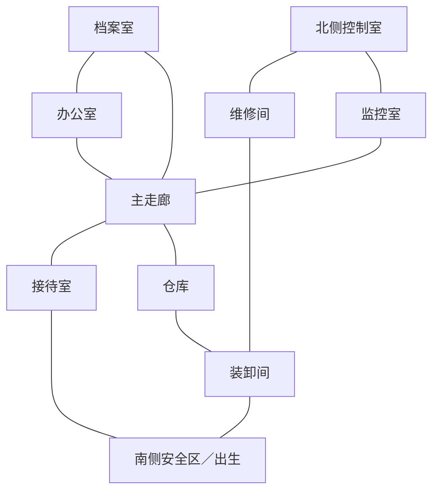

# Scarlet Contract：战术指挥 Demo 设计规格

版本：1.4.1（实现依据；本次交付核对见 [验收记录](validation.md)）  
日期：2026-09-06  
适用范围：当前 `combat_demo`，Windows 桌面、键盘鼠标、单人离线游戏。

本文规定本次 Demo 的玩法、内容、视觉、操作、失败处理与验收条件。文中的数值是本版本实现值，不由实现者自行替换；修改规则或数值时必须先更新文档并获得用户认可。本文获认可前不代表已授权修改代码。

指挥与 AI 的现行规则集中于 [command_and_ai.md](command_and_ai.md)，本文件对应章节已同步修订。

### 定义的阅读规则

- “默认”仅用于列明了其他选项的玩家可选设置，表示新任务初始选项；不表示实现者可以另选方案。
- “允许／禁止”规定玩家操作权限。“至少／最多”规定有效范围，并包含边界值；实现不得在此范围外接受输入。
- 条件分支必须给出触发条件与结果。未使用条件分支的视觉元素只采用表中规定的一种形状；不得用未列明的备选图形替换。
- 时间单位为模拟秒；菜单悬停、双击判定与提示停留使用现实毫秒。文中明确写“现实时间”的测量不受暂停和速度影响。
- 距离使用格中心的欧氏距离；寻路成本使用四向移动步数；所有“范围内”均包含边界。坐标排序固定为先 y 后 x，角色排序按数字 ID 升序，字符串 ID 按字典序。
- 示例、流程图用于解释已定义的规则，不产生额外功能。扩展说明只约束复用方式；正式关卡的物品、动作和菜单条目以本版本的清单为准。
- 函数命名、局部变量与缓存组织属于实现细节；图形形状、显示参数、交互结果、世界规则和内容数据属于本文规定，不属于实现者自由选择的细节。

## 1. 玩家体验与设计目标

玩家是四人战术小队的指挥者，可以同时选择、指挥多个角色。多数时候只需要表达“到这里集结”“破门进入这个房间”“守住这个方向”；队员自行分配位置、执行动作、观察、射击。遇到复杂情况，玩家暂停时间，为每个人指定路线、朝向、目标和行动顺序，然后继续执行。

这两种操作使用同一组角色、同一套时间和世界规则。微操精度体现在指定位置与动作，不另设 WASD 操控一个角色、鼠标连续开火的射击模式。

Demo 必须证明以下四点：

1. **抽象命令有效。** 一次“突入 → 破门突入”依次完成门外集结、同步等待（仅选择同步时）、踹门、进入、分区观察和就位，不需要玩家逐人补发移动命令。
2. **微操真正有权威。** 玩家指定的站位、警戒方向和行动顺序不会被自动行为悄悄覆盖。
3. **信息影响决策。** 玩家知道建筑布局，却不知道未观察到的敌人位置；观察、门、墙和枪声有明确作用。
4. **完整且有表现力。** 从任务简报到歼灭全部敌人、结算重试均可完成，界面与音画反馈足以解释发生了什么。

### 1.1 核心循环

阅读建筑平面图 → 选择入口 → 集结与警戒 → 观察或突入 → 发现敌情 → 暂停微调 → 搜索剩余区域 → 消灭全部敌人 → 查看结果。

### 1.2 规模与体验测量目标

下表的现实游玩时长是试玩记录的比较区间，不是倒计时或通关门槛。暂停时长由玩家决定，超出该区间不会改变胜负规则。

| 项目 | 确定目标 |
|---|---|
| 首次完整体验 | 15–25 分钟现实时间，包含阅读提示和暂停规划 |
| 熟悉后通关 | 8–15 分钟现实时间 |
| 小队 | 4 名，均可单独或编组指挥 |
| 主关卡 | 1 张固定手工地图，3 个固定敌情配置 |
| 敌人 | 每个配置 10 名敌人，无非战斗人员 |
| 时间模式 | 暂停、0.5 倍速、1 倍速；暂停次数与时长不限 |
| 战斗气质 | 紧张、短促、位置重要；不以点击速度作为门槛 |
| 主要成功指标 | 使用抽象命令能够通关，微操能够改善伤亡和执行效果 |

## 2. 内容边界

### 2.1 本次必须交付

- 标题界面、任务简报、嵌入式操作提示、游戏设置、完整关卡、结算与重试。
- 四人选择、框选、两个持久编组、上下文命令、暂停规划、逐人命令队列。
- 移动、集结、守卫；“突入”分类固定包含直接突入、破门突入、使用闪光弹突入三个方式。
- 门与队员位置的分级右键菜单、动态物品列表、通用目标选择和一致的提交／取消流程。
- 每个角色的指定路径、定点警戒、指定目标、换弹、包扎、闪光投掷与同步等待。
- 队友自主执行，敌人巡逻、警戒、调查、交火、失去目标后的搜索。
- 共享视野、最后目击标记、粗略声音线索、射线遮挡、友军误伤、友军射线避让。
- 门、房间、全高遮挡、低掩体、身体伤害、弹药与有限耗材。
- 清楚的阶段、阻塞原因、路线和同步状态；统一的复古战术显示器线框视觉与本地音效。
- 可重复的无窗口行为验证，以及人工从启动到结算的通关验收。

### 2.2 本次不包含

解救、护送、撤离目标、非战斗人员、联网、多楼层、开放世界、地图编辑器、战役成长、装备商店、完整背包、可破坏建筑、真实弹道下坠、穿墙射击、烟雾传播、复杂光照潜行、投降逮捕、倒地复活、拖拽尸体、流血倒计时、不同物种、程序生成地图、完整录像回放。

门的“破坏”只是预设门状态变化，不扩展为任意物体破坏。窗户只作为固定观察／射击开口，不可翻越。低掩体不可跨越。现有破片手雷不放入本关卡装备。

这些取舍把开发量集中在最有辨识度的“多人执行与暂停干预”上。未来新增功能需要重新讨论范围，不能影响本次完整体验的交付。

## 3. 任务：灰港档案室

### 3.1 简报

一支武装团伙占据灰港的一处物流办公设施。四人小队从南侧进入，搜索设施并消灭全部敌人。建筑结构已知，敌人具体位置未知。没有非战斗人员、外部增援或隐形任务倒计时。

简报明确共有 10 名敌人。HUD 显示任务级“消灭敌人 0/10”，死亡结算后即时更新；这是有意提供的全局任务进度，不提供未见敌人的位置、身份或行动状态。目标是避免关卡结束条件含糊，同时保留逐房搜索的必要性。

### 3.2 目标与结算

- 主要目标：消灭关卡中全部 10 名敌人。
- 成功：同一模拟步全部伤害和死亡处理结束后，敌人存活数为零且至少一名队员存活，自动进入成功结算。
- 失败：四名队员全部死亡；若同一步双方全部死亡，按任务失败处理。
- 队员个人死亡不立即失败；只剩一名队员仍可用单人操作完成任务。
- 不要求返回出生区、不需要撤离按钮、不要求把每个房间标成搜索完成。
- 游戏内没有救活死亡单位的手段。任务结束后冻结全部世界动作，包括已投出的物品，不再产生结算后的伤亡。
- 暂停不计入任务模拟用时，不影响成绩。

结算显示成功／失败原因、敌人消灭数、队员存活与伤势、模拟用时、暂停次数、友军受击次数、消耗弹药和各类道具数量。结算后才能显示全部敌人的最终位置与状态。

成功评级为三个独立徽章：歼灭完成、全员生还、无误伤。失败不发徽章，不设置鼓励抢时间或刷击杀的综合分数。

“歼灭完成”在成功结算时授予；“全员生还”要求成功且四名队员均存活；“无误伤”要求成功且己方向其他己方造成正值 HP 伤害的次数为零。闪光误震不扣“无误伤”徽章，单列为“友军震撼次数”。同一次闪光影响两名己方计两次。弹药统计在射击释放时增加，道具统计在实际消耗时增加。暂停次数只统计运行→暂停转换，开局暂停不计数，队员死亡自动暂停计一次；已暂停时再次收到自动暂停事件不增加次数。

### 3.3 开局与重试

开局四人在南侧安全区，默认暂停、全选，显示“选择队员 → 右键下令 → 空格继续”提示。第一次任务默认敌情配置 A；通关或失败后可选择同配置重试、下一个配置或返回标题。重试重新创建全部任务状态。

## 4. 关卡规格

### 4.1 空间结构

地图采用 48×36 逻辑格，1 格 = 1 米，单层、正交墙面。主走廊宽 6 格，走廊障碍所在行保留 3 格净通路；门宽 1 格。地图具体矩形、边和家具位置以第 4.4 节为准。

共 10 个命名区域：南侧安全区 S、接待室 R、主走廊 C、办公室 O、档案室 A、监控室 M、仓库 W、装卸间 L、维修间 U、北侧控制室 N。S 是出生区；C 是走廊；其余为 8 个可执行房间搜索的室内区域。

下面是连接关系，不是按比例平面图。所有连接都在关卡数据中显式列出，未列出的相邻区域之间是墙。



| 连接 | 初始状态 | 设计用途 |
|---|---|---|
| S–R | 关闭、未锁门 | 正门，第一次练习集结与开门 |
| S–L | 关闭、未锁门 | 侧门，允许分队进入 |
| R–C | 开放通道 | 接待室视线延伸到走廊，但转角阻断北侧视线 |
| L–W | 关闭、未锁门 | 仓库正面入口 |
| L–U | 关闭、未锁门 | 外围绕行路线 |
| W–C | 关闭、未锁门 | 可与 L–W 组成双入口同步行动 |
| U–N | 关闭、锁定门 | 绕行路线的破门成本 |
| C–O | 关闭、未锁门 | 普通房间搜索 |
| O–A | 关闭、未锁门 | 档案室侧入口 |
| A–C | 关闭、锁定门 | 正面快速强攻选择 |
| C–M | 关闭、未锁门 | 通往北侧的内路线 |
| M–N | 关闭、未锁门 | 北侧控制室第二入口 |

共 11 扇门、1 处开放通道。增加 2 个不可移动通过的固定窗：O–C、M–C。窗户只在其墙段提供视线和射击通道。

### 4.2 房间内部要求

- R：前台作为低掩体；入口外可容纳全队集结，保证第一个命令有清楚的反馈。
- C：两组全高障碍分别占走廊左半侧和右半侧，形成两次绕行并阻断南北直线视野。
- O：办公桌与隔断，存在一个需要侧移观察的盲区。
- A：全高档案柜与两条通道；有双入口选择，检查柜后盲区是搜索重点。
- M：屏幕与工作台，主要承担观察和北侧连接，不设置新“黑客”系统。
- W：16×15 格空间，固定两块低掩体和两块全高货架，两个入口均配置四个集结槽。
- L：装卸标线、箱体；让侧路不是贴着主路复制。
- U：8×15 格工具间，南接装卸间，北接控制室，形成独立于主走廊的路线。
- N：北侧主要防守区域；两个入口分别通向不同观察角度，避免唯一入口正对不可绕行的火力点。

每个入口的槽位和每个房间的观察点按第 8.5 节的算法从第 4.4 节固定地图生成，加载时保存为关卡数据。不得手工根据敌人出生点修改槽位。执行时仍检查占位、路径和当前可见威胁。

### 4.3 敌情配置

每次 10 名敌人，不安排员工或其他非战斗人员：

| 配置 | R | C | O | A | M | W | L | U | N |
|---|---:|---:|---:|---:|---:|---:|---:|---:|---:|
| A：标准 | 1 | 1 | 1 | 1 | 1 | 2 | 0 | 1 | 2 |
| B：侧路戒备 | 0 | 1 | 1 | 1 | 1 | 2 | 1 | 1 | 2 |
| C：内线戒备 | 1 | 2 | 1 | 2 | 1 | 1 | 0 | 0 | 2 |

每个配置预设合法出生格、警戒方向和巡逻点；随机种子只影响可复现的战斗随机量。敌人不在玩家起始视野或南侧安全区出生。不同配置不改地图、物资或目标规则。

### 4.4 固定地图数据

坐标原点在左上角，x 向右、y 向下，格坐标从零开始。下表矩形两端均包含。未列为区域的格子为不可移动、不可见穿过、不可射穿的全高封闭区。两个不同区域的相邻格之间全部设置墙，再按连接表替换门和开口；同一区域内部不额外加墙。

| 区域 | 左上格 | 右下格 |
|---|---|---|
| S | (1,30) | (46,34) |
| R | (25,25) | (46,29) |
| C | (25,10) | (30,24) |
| O | (31,17) | (46,24) |
| A | (31,10) | (46,16) |
| M | (25,1) | (30,9) |
| W | (9,10) | (24,24) |
| L | (1,25) | (24,29) |
| U | (1,10) | (8,24) |
| N | (1,1) | (24,9) |

边记作“格坐标＋边方向”，N 为北边，E 为东边。门 ID 为 `door_` 加连接名，连接名中的字母按表中顺序。

| 连接／对象 | 边位置 |
|---|---|
| S–R | (35,30) N |
| S–L | (12,30) N |
| L–W | (17,25) N |
| L–U | (4,25) N |
| W–C | (24,18) E |
| U–N | (4,10) N |
| C–O | (30,21) E |
| O–A | (39,17) N |
| A–C | (30,13) E |
| C–M | (27,10) N |
| M–N | (24,5) E |
| R–C 开放通道 | (26,25) N、(27,25) N、(28,25) N，共三条连续边 |
| O–C 窗 | (30,23) E |
| M–C 窗 | (29,10) N |

所有墙和关闭门高 2.2 米；窗台高 1.2 米，上方开口至 2.2 米；低掩体高 1.0 米，全高家具高 2.2 米。家具均占满所列矩形的格子并阻挡移动。

| 区域 | 低掩体矩形 | 全高家具矩形 |
|---|---|---|
| S | 无 | 无 |
| R | (33,27)–(36,27) | 无 |
| C | 无 | (25,15)–(27,15)；(28,19)–(30,19) |
| O | (37,20)–(40,20) | (35,18)–(35,20) |
| A | 无 | (35,11)–(35,14)；(41,12)–(41,15) |
| M | (26,3)–(28,3) | 无 |
| W | (12,19)–(14,19)；(20,13)–(22,13) | (13,12)–(14,16)；(19,18)–(20,22) |
| L | 无 | (8,27)–(9,28) |
| U | (3,15)–(4,16) | 无 |
| N | (17,5)–(19,5) | (10,4)–(11,7) |

除本表之外不添加阻挡家具。装卸间两条装饰线位于 y=26.25 和 y=28.75，从 x=13 延伸到 x=22，线宽 1 像素。它们不参与物理判定。

### 4.5 出生点、巡逻与随机种子

四名队员 ID 固定为 1–4，依次出生在 (33,32)、(35,32)、(37,32)、(39,32)，全部面向北。敌人按下表区域顺序、区域内候选序号分配 ID，从 101 开始；按第 4.3 节数量取该区域前 n 个候选点。

| 区域 | 候选 1／朝向 | 候选 2／朝向 |
|---|---|---|
| R | (39,26)／北 | 无 |
| C | (28,12)／南 | (26,22)／北 |
| O | (43,19)／西 | 无 |
| A | (39,12)／南 | (44,15)／西 |
| M | (28,6)／南 | 无 |
| W | (17,14)／南 | (22,21)／西 |
| L | (19,27)／北 | 无 |
| U | (5,13)／南 | 无 |
| N | (7,4)／南 | (19,7)／西 |

三个配置均把 C、W、N 的候选 1 指定为巡逻者，其余为固定哨兵。C 的巡逻点为 (28,12)、(29,17)；W 为 (17,14)、(17,21)；N 为 (7,4)、(7,7)。巡逻者从第一个点出发，到第二个点后返回，反复循环；到点观察 1 秒，朝向取通往下一个点的首个移动方向。

配置 A、B、C 的战斗种子分别为 7、17、27。固定同配置重试不更换种子。标题界面的配置选择顺序为 A、B、C；“下一个配置”按 A→B→C→A 循环。

## 5. 四人小队与装备

| 编号／呼号 | 表现定位 | 装备 |
|---|---|---|
| 1／先锋 | 默认突入第一位 | 步枪、1 枚闪光、1 份包扎用品 |
| 2／侧翼 | 默认突入第二位 | 同上 |
| 3／支援 | 默认后续进入与观察 | 同上 |
| 4／后卫 | 默认最后进入与守后方 | 同上 |

四人使用相同移动、感知和武器参数；呼号与编号帮助识别，不存在隐藏职业加成。任何队员都能开门、破门，并使用自己持有且适用的物品。默认顺序可在突入预览中调整。

每人携带 30 发已装填弹药和 90 发储备；换弹补充到 30 发，按实际补充量扣储备，保留原弹匣剩余子弹。弹药和耗材不能队内转移，不可从尸体拾取。敌人每人 30+60 发，不携带闪光，不使用包扎。

## 6. 选择、编组与操作

### 6.1 默认按键

| 输入 | 行为 |
|---|---|
| 左键角色／队员卡 | 单选，地图上的非队员不会成为可控对象 |
| Shift+左键 | 增减当前选择 |
| 空地左键拖动 | 左键移动超过 4 屏幕像素后开始框选，松开时选择中心位于矩形内的存活队员；不超过 4 像素则清空选择；从角色身上开始不触发框选 |
| 1–4 | 单选对应队员；300 现实毫秒内第二次按同键将镜头中心移到该队员；死亡队员键只定位尸体，不加入选择 |
| Ctrl+A | 全选存活队员 |
| Ctrl+F1／F2 | 保存当前选择为编组一／二 |
| F1／F2 | 选择编组；默认一组 1、2，二组 3、4 |
| 右键地面 | 松开时移动到按下格；拖出至少 16 屏幕像素指定本路段固定观察角度；落点分散到不同格 |
| 右键门／房间标签 | 在对象附近打开菜单，使用当前所选队员，不立即行动 |
| 右键己方队员／队员卡 | 打开该队员的个人菜单和实际持有物品，只作用于此人，不改变原来的多选集合 |
| 右键当前可见敌人 | 显示“攻击此目标”，左键该条目即给所选队员提交指定攻击，不增加确认弹窗 |
| Shift+提交微操 | 追加微操节点；角色关联宏观行动时仍先取消宏观并接管。宏观草稿追加保留原含义 |
| 空格 | 暂停／继续，保留之前选择的运行速度 |
| Tab | 0.5／1 倍速切换；暂停时只更改恢复速度 |
| Q | 进入定点警戒工具：选位置，再点方向 |
| R | 所选队员换弹；不再作为重开快捷键 |
| G | 当前单选者有可用闪光时进入投掷选点；多选时先在候选队员列表选择一人，与物品菜单共用同一流程 |
| H | 所选队员各自包扎 |
| X | 取消所选队员计划，停到下一个合法格并保持警戒 |
| Esc | 先取消当前工具，再关闭菜单，最后打开暂停菜单 |
| WASD／中键拖动 | 平移镜头，滚轮缩放 |

所有核心动作都有可点击按钮。选中一个单位时显示详细队列，多选时显示人数、共同命令与不同状态。鼠标经过地图预览路径、落点和对象名称；点击 HUD 不穿透到地图。R／H 是批量便利快捷键，整组选中角色全部验证通过后才提交；右键角色使用物品始终只作用于被右键的那一人。

### 6.2 暂停的精确定义

- 暂停时角色、门、弹药、动作、AI、警报、投掷物和任务计时全部冻结。
- 允许选择、移动镜头、编辑命令、调整顺序、选择同步标签与查看已知信息。
- 修改的是计划；不会在暂停时移动角色、转身、装填或实际消耗道具。
- 已下达计划立即显示路线与阶段；恢复后在下一个模拟步开始处理。
- 不用行动点，不限制暂停次数。每个队员首次由存活转为死亡时，在当前模拟步结束后暂停；同一步多人死亡只触发一次，恢复后不因这些尸体再次暂停。任务结束直接进入结算。设置项“首次发现敌人时暂停”默认关闭，开启后每局首次识别敌人时触发一次，不按每个敌人重复触发。

### 6.3 命令对象、执行者与选择集合

统一区分三件事：当前选中了谁、正在对哪个对象下令、谁实际执行动作。菜单标题和预览必须表达这些信息，不能靠玩家猜。

| 右键对象 | 菜单标题示例 | 执行者规则 |
|---|---|---|
| 门 | `仓库西门 · 装卸间 → 仓库 · 已选 2 人` | 打开菜单时锁定当前所选存活队员；具体开门者／投掷者在预览中指定 |
| 房间标签 | `仓库 · 已选 4 人` | 使用所选队员；按第 7.2 节计算初始入口，玩家在预览中选择其他合法入口 |
| 己方队员 | `③ 支援 · 个人指令` | 仅该队员，保留原全队／编组选择；用临时轮廓标明此次执行者 |
| 队员卡 | 与右键该队员相同 | 可在角色被遮住或镜头外时使用其物品 |
| 可见敌人 | `攻击目标 · 已选 2 人` | 当前所选队员；指定攻击遵循第 9.3、10.1、11.1 节 |
| 空地 | 不打开菜单，显示移动预览 | 按下锁定当前选择与目标格，松开提交移动 |

没有选中队员时，门菜单仍可查看，但动作禁用并提示“先选择队员”；不会自动调来最近的队员。右键个人菜单无需预先左键选中该人。

打开菜单时保存对象 ID 与执行者快照；悬停经过其他人物或门不会改变它们。玩家用 1–4、编组键、全选或左键选择另一个角色时，取消尚未提交的菜单／目标选择，再执行新的选择操作。不会把正在瞄准的道具悄悄换成别人的。

对象重叠时，鼠标命中优先级为菜单／提示中的按钮 → HUD → 活队员 → 可见敌人 → 门 → 死亡己方单位 → 房间标签 → 地面；同级重叠按鼠标到对象中心距离排序，同分按对象 ID。队员命中半径为 max(r,10) 屏幕像素；门的命中区域为逻辑门线段向两侧各扩展 6 像素。悬停时显示命中对象描边和名称。门被人挡住时，玩家从房间标签选择相同入口。

### 6.4 门菜单与“突入”子菜单

右键门后，一级菜单锚定门中点的屏幕坐标，初始左上角为锚点向右、向下各偏移 12 像素；越界处理遵守第 6.5 节。**“突入”是分类入口，悬停展开方式，悬停本身永不执行动作。**

```text
┌ 仓库西门 · 装卸间 → 仓库 ┐
│ 执行者：①先锋、②侧翼      │
├──────────────────────────┤
│ 门外集结                 │
│ 操作门                 ▶ │ ┌ 开门                 ┐
│ 突入                   ▶ │ │ 踹开                 │
│ 守住门口                 │ └──────────────────────┘
└──────────────────────────┘

悬停“突入”时（替换“操作门”的子菜单）：
                            ┌ 突入方式                     ┐
                            │ 直接突入                     │
                            │ 破门突入                     │
                            │ 使用闪光弹突入 · 可用 2 枚   │
                            └──────────────────────────────┘
```

同一时刻只显示一个兄弟子菜单。这里用两幅状态说明展开内容，不同时展开“操作门”和“突入”。

| 条目 | 点击后的结果 | 本次可用条件 |
|---|---|---|
| 门外集结 | 打开简短预览，显示门的哪一侧与分配槽位 | 1–4 人，集结侧已知可达 |
| 操作门 → 开门 | 预览显示单一执行者、走到门边的路线和开门动作 | 所选 1–4 人；已知关闭未锁时允许，未知时允许并标注到门边确认，已知打开、破坏、锁定时禁用 |
| 操作门 → 踹开 | 同上，动作改为踹门，不自动进入房间 | 所选 1–4 人；已知关闭时允许，未知时允许并标注到门边确认，已知打开、破坏时禁用 |
| 突入 → 直接突入 | 生成“普通开门或通过已开门 → 进入并搜索”草稿 | 2–4 人；已知锁门时禁用，提示“门已锁，请选破门方式” |
| 突入 → 破门突入 | 生成“踹门 → 进入并搜索”草稿 | 2–4 人；已开／破坏门时禁用并提示使用直接突入 |
| 突入 → 使用闪光弹突入 | 生成“开门方式 → 使用闪光弹 → 进入并搜索”草稿 | 2–4 人，按第 13.4 节当前替换／追加方式计算的有效闪光数至少为 1；选投掷者及落点 |
| 守住门口 | 预览门外槽位、默认朝门的方向，可调整朝向 | 1–4 人 |

“直接突入／破门突入／使用闪光弹突入”是本次显示的方式，不是三套互不相干的顶层指令。内部均为一次房间任务的不同准备步骤。未来有适用物品时，可以在同一子菜单增加“使用某物品突入”；不把每种物品都增加到一级菜单。

闪光方式的预览另有“开门方式：普通打开／踹开”选择：已知未锁默认普通打开，已知锁定默认踹开，已打开则显示“直接通过”。未知状态默认普通打开并提示“尚未确认，遇锁会停止”；不擅自升级为踹门。

房间突入只适用于 R、O、A、M、W、L、U、N 八个房间；目标侧是 S 或 C 时禁用“突入”，提示“目标不是房间”。操作门和门外集结仍可用。无物品突入同样必须搜索，菜单不再提供一个独立的“只进入不搜索”选项。

### 6.5 悬停、菜单布局与实时行为

- 悬停带箭头的条目 180 毫秒展开子菜单；点击该条目立即展开，仍不提交。鼠标移到另一个父条目时，延迟 180 毫秒后切换。
- 根菜单超出窗口时将其 x、y 分别限制到 [8,窗口宽−菜单宽−8] 与 [8,窗口高−菜单高−8]。子菜单优先在父菜单右侧，顶部对齐父项；右侧放不下则放到左侧，箭头同步向左；垂直方向采用同一夹取规则。菜单避让边界是整个窗口，不是地图视口，允许覆盖 HUD。菜单压住对象时，在菜单标题保留对象名称并将其定位指示线绘制到菜单边缘，不再尝试重新挪动菜单。
- 父项到子菜单之间保留连续命中走廊；跨越接缝时保留当前分支 300 毫秒，避免斜向移动导致菜单消失。
- 移出整个菜单后保留 300 毫秒再收起子菜单，根菜单保持到明确点击或取消。菜单宽度固定为 280 屏幕像素，行高固定为 32 像素，标题高 48 像素，分区标题高 24 像素，上下内边距各 8 像素。总高度上限为窗口高减 16 像素；超过时条目区滚动，每格滚轮移动一行。长名称在剩余文本宽度内省略尾部，悬停提示完整名称。菜单滚轮事件不得传到地图。
- 本次所有菜单最多两层：对象根菜单＋动作子菜单。额外参数统一进入草稿，不增加第三层菜单。
- 禁用条目置灰但可以悬停查看原因；点击不关闭菜单，不取消原计划。不在本次内容中的物品不显示占位条目。
- 右键菜单、目标选择和命令预览都不自动暂停。玩家可以按空格暂停／继续，菜单状态保留，顶部时间状态始终可见。
- 菜单打开时相机不做鼠标边缘滚动；主动平移／缩放时菜单保持当前屏幕位置，仍标记原对象。个人菜单不会追着移动角色跑。
- 实时变化会更新库存、存活和可用性，但不改变已展开条目的顺序与命中区域；失效的条目原位禁用，避免点击瞬间错选。下次打开菜单再重新排序。
- 执行者或目标死亡时，保留可见原因并禁用提交；玩家可取消。任务结算则统一关闭菜单、选点与草稿；不会把先前未提交输入带到结算或重试后的新世界。
- 上下方向键选择同层条目，右键盘方向键展开、左键盘方向键返回，Enter 激活叶项，Esc 返回；与鼠标操作使用同一套选择状态。

### 6.6 从菜单到执行：唯一提交点

```text
右键对象 → 展开分类 → 点击具体动作
                         ├ 自身动作：立即提交
                         ├ 单人指向动作：选目标 → 左键有效目标提交
                         └ 多人／门行动：草稿预览 → 动作要求目标时选点 → 点击“下达”提交

提交成功 → 菜单关闭 → 显示执行／排队状态
提交失败 → 保留当前选择流程 → 显示具体原因 → 原计划不变
```

“立即提交”在暂停时仅写入计划，实际执行仍等待恢复。浏览分类、修改草稿、预览落点不预约道具、不移出原队伍任务、不清空既有队列。

多人／门行动在右侧显示草稿卡，字段顺序固定为：目标门与进入方向、参与者与顺序、开门方式、物品与执行者、落点、立即开始／等待 A／等待 B、替换／追加、下达／取消。落点字段仅在动作目标类型为地面时显示。菜单在进入草稿后关闭；草稿提供突入方式下拉框，选择后重新生成相关字段并验证资源，不需要重新右键。

每个参数带有可见当前值；无须的参数隐藏，例如无道具的突入不显示落点按钮。选点是草稿的一部分，选完回到草稿，只有点击“下达”才改变计划。下达按钮旁始终显示“替换 2 人计划”或“追加到 2 人队列”，以及任何被替换的小队任务影响。单人即时动作的菜单底部和瞄点提示条同样显示“替换／追加”与“将取消关联行动，影响全组成员”等影响，信息在最终点击前可见，不另弹确认。

房间突入固定使用已锁定的参与者集合；个人门操作即使打开菜单时多选，草稿也只分配一个执行者，默认选择到交互格路径最短者、同分按编号排序。其他所选队员不会因该单人开门动作被取消计划。标题下明确显示“执行：①先锋；其他队员保持原计划”。

普通提交默认替换；按住 Shift 时，按钮和鼠标旁实时显示“追加”，在最后一次提交点击时取值。草稿也可直接点击“替换／追加”切换；Shift 只临时强制追加，松开恢复草稿中的选择。多人的任务按整体校验，任一参与者队列已满则全部不提交，避免只发出一半的突入行动。

提交必须在同一次操作里完成“检查目标、角色、队列、资源 → 替换旧计划（如需要）→ 预约新资源 → 创建新计划”。不能先取消旧计划再发现新计划不合法。

### 6.7 取消与切换的精确行为

| 当前状态 | 输入 | 结果 |
|---|---|---|
| 根菜单／子菜单 | 左键菜单外空白 | 关闭菜单，仅取消本次浏览；不发移动命令、不清空选择 |
| 根菜单／子菜单 | 左键菜单外的己方角色／队员卡 | 关闭菜单，然后按单选／Shift 增减规则改变选择；与点击空白区分 |
| 子菜单 | Esc | 收起最深一层；下一次 Esc 再关闭根菜单 |
| 独立道具选点 | 右键或 Esc | 退出瞄点，回到该角色物品菜单；不消耗、不改变旧任务 |
| 草稿内选点 | 右键或 Esc | 回到草稿；进入选点前已有落点则保留该值，否则维持“未选择” |
| 草稿 | 取消或 Esc | 关闭草稿，原计划保持 |
| 菜单／草稿 | 右键另一个对象 | 丢弃当前未提交草稿，打开新对象菜单；右键空地仅关闭，不顺带移动 |
| 已提交的行动 | X／队列删除 | 按第 9.1、11.4、13.4 节处理，释放被取消节点的未消耗预约 |

处于选点模式时，右键总是先退出选点，不在同一点击中切换对象。悬停／点击 UI 不成为地图落点。无效落点左键只显示原因并保持选点，不能悄悄投向最近的合法位置。

### 6.8 其他对象菜单与状态反馈

- 右键房间标签：固定显示“突入 ▶”“守住这里…”和“查看搜索记录”。突入子菜单与门菜单共用方式列表；点击后在草稿中选择入口，按第 7.2 节计算初始入口。没有合法入口时禁用突入并提示“无可达入口”。查看搜索记录在右侧面板显示房间状态、最后完成时间及当前已知威胁数，不下令。
- 右键可见敌人：显示“攻击此目标”，执行者为所选队员；点击直接提交。如果该目标在点击前失去视野，条目原位禁用，不能转换为对最后目击点的盲射。
- 右键死亡队员：显示姓名与死亡状态、只读装备信息，所有使用动作禁用；本次没有拾取或转移物品。
- 门菜单不因隐藏敌人而改变条目或文字。进入方向按第 7.2 节计算；玩家切换方向后重新校验全体参与者路径，不能提交任何一人不可达的集结侧。

屏幕反馈使用统一状态词：`草稿`（未提交）、`排队`、`执行中`、`等待信号`、`挂起`、`完成`、`已取消`。任务阶段作为第二行，例如“执行中／门外集结”。失败显示原因和可用操作；房间任务只允许修改、重试或取消，不能通过“跳过物品”偷偷改变突入方式。第 13.4 节的“跳过”只针对独立的个人队列节点。

全体同一次提交完成后，消息条只出现一条摘要，如“①②：使用闪光弹突入仓库，等待 A”，避免每个底层移动步骤都刷屏。悬停队员卡可查看细节，点击挂起消息定位相关角色／门。纯菜单悬停不产生命令确认音。

## 7. 抽象命令定义

下表是行为规格，UI 按第 6 节分级呈现；不把每一行都摊成一级按钮。上下文菜单只显示该目标适用的命令；已装备但暂不可用的物品／动作保留并说明原因，例如“需要至少两名队员”“门已破坏”“已预约，无可用闪光弹”。从未携带且不适用的物品不出现。

| 命令 | 参与者与输入 | 执行过程 | 完成条件 |
|---|---|---|---|
| 移动到此 | 1–4 人、目的格 | 按第 7.2 节分配不同落点，沿途按交战规则处理威胁 | 全部参与者到达分配格 |
| 门外集结 | 1–4 人、门与所在一侧 | 按第 8.5 节分配槽位与朝向 | 全部到位后转为持续警戒 |
| 守住这里 | 1–4 人、中心与方向 | 分配附近格，保持朝向，交战后回到指定观察方向 | 到位即建立持续守卫，直到被替换 |
| 突入 → 直接突入 | 2–4 人、入口与房间 | 集结、打开未锁门或通过已开门、依次进入、访问观察点、就位 | 观察点已检查且无已知未处理威胁；标为“搜索完成” |
| 突入 → 破门突入 | 2–4 人、入口与房间 | 集结、踹门、依次进入、搜索、就位 | 同上；门永久变为破坏开放状态 |
| 突入 → 使用闪光弹突入 | 2–4 人、入口、房间和落点 | 集结、按选定方式开门、投掷、等待起爆、进入、搜索 | 同上；每次只消耗一枚闪光 |

普通移动不自动打开任何关闭门、不跨越掩体、不绕经未授权的其他房间来替代选定入口。预览发现需要过关闭门就显示“路径被关闭的门阻断”，提示先开门或下达房间行动。

房间命令的初始入口和方向按第 7.2 节选定，预览寻路只使用己方已知的门状态。所有入口均不满足规则时拒绝提交。未知门在预览中视为阻断边，但仍允许下达以它为目标的开门／突入任务并抵达其近侧；观察到真实状态后重新校验该门准备步骤，条件不符则挂起。不得使用隐藏门状态提前决定路线或禁用条目。

### 7.1 “搜索完成”不等于绝对安全

房间的状态为：未搜索、搜索中、搜索完成、发现威胁。

房间状态按以下优先级计算：该房间存在己方当前可见的存活敌人 → 发现威胁；否则有未结束的房间搜索任务 → 搜索中；否则有最近一次成功完成搜索的记录 → 搜索完成；否则 → 未搜索。时间显示最近一次成功完成的模拟时刻，没有记录时显示“未完成搜索”。

房间任务完成要求全部观察点完成，且参与者对房内目标的有效记忆已处理：当前可见目标仍存活时继续交战；失去视野目标按第 10.1 节记忆 5 秒，前往最后目击点后观察 0.4 秒仍未发现则提前清除该条记忆；目标在视野内死亡则立即清除。完成不读取隐藏敌人存活数，不能标记为永久安全。

### 7.2 路径、落点与入口选择

所有路径采用四向最短步数，邻居访问顺序为北、东、南、西。关闭门、未知门、窗、占满格子的家具不可通过；同一区域的活人占格允许作为途中格，不能作为另一个人的最终停靠格。寻路不依据未见敌人的位置添加阻挡。

多人移动和“守住这里”以目标格为中心，候选取同一区域内欧氏距离不超过 2 格的合法停靠格。参与者按编号顺序分配；每人的候选按距点击格的平方距离、本人路径步数、坐标排序，取首个未分配格。任一人没有候选则整条命令拒绝。单人明确移动到格必须到原目标格，不做邻格替代。守卫的所有人面向玩家指定方向；普通移动到达后保持最后一个移动段方向。

对每个房间入口及其外侧生成一个候选。候选有效条件为：所有参与者均能在不经过目标房间的前提下到达分配的集结槽。计算各人到槽位的路径步数之和，取最小值；同分依次按入口 ID、外侧区域 ID 排序。右键具体门时只比较该门两侧，不能换成其他门；右键房间时比较全部入口。玩家切换入口／方向后使用同一有效性检查。

途经区域只允许所选路径上的已开通连接；入口选定后不因挂起自动换门。每次路径重算使用相同排序，不给行动追加新的房间任务。

## 8. 房间行动的确定执行规则

### 8.1 下令预览

提交前按第 6.6 节显示草稿：参与者顺序、入口、每人的门外槽位、进入路线、最终警戒扇区、道具执行者与落点，以及“立即开始”或“等待同步 A／B”。修改顺序用队员列表上的上移／下移按钮。选择同步等待仍通过同一个“下达”按钮提交任务，任务先集结再等待信号。

提交成功只表示计划合法，不保证未来不会因交火而中断。明确显示当前阶段和任何阻塞原因。

### 8.2 执行状态

```text
计划已接收 → 门外集结 → 就绪等待 → 开门／破门
                                     ↓
                            投掷并等起爆（如选择）
                                     ↓
                          按序进入 → 分区搜索 → 就位完成

任一执行阶段 → 遭遇交火（处理后可恢复原阶段）
任一执行阶段 → 挂起（意外／条件失效，等待玩家继续）
任一执行阶段 → 取消（玩家接管，原行动不能恢复）
任一执行阶段 → 取消（保留已发生的世界结果）
```

### 8.3 分工、通行与搜索

1. 按玩家指定的顺序分配四个入口槽；同等候选以格坐标排序，避免随机跳动。
2. 第一位负责开门／踹门；道具执行者从参与者中有可用道具者按顺序推荐，预览中可换人。提交后绑定具体执行者与物品预约，不在执行中悄悄改派他人。
3. 全员存活、抵达分配槽位、朝向误差不超过 5°、没有互斥动作和震撼，且没有当前可见敌人时才就绪；发现过敌人的集结需额外满足连续 1 秒无当前可见敌人。
4. 同一个门口每次仅允许一名队员通过。前一人离开门内第一格后下一人开始通过，最小间隔 0.25 秒。
5. 第一、第二位去不同侧的进入槽；三、四位再依序进入。两人队伍分担全部观察点，四人队伍可并行覆盖。
6. 观察点按第 8.5 节分配；到位、朝向误差不超过 5°且没有互斥动作时，连续观察 0.4 秒完成该点。离位、转向超出误差、震撼或开始互斥动作时，该点未完成的观察计时归零。
7. 看见威胁时就地交战；不得追出被命令搜索的房间。威胁暂时失去视野后最多追查房内最后目击点，不能依据隐藏位置跟踪。
8. 所有观察点完成且满足第 7.1 节后，各人停止在最后完成的观察点；队列顺序最后一名面向本次进入门中点，其他人面向房间几何中心。终点等于房间中心时保持最后观察方向。

### 8.4 挂起与伤亡

- 停靠格被其他存活单位占用：候选限制在原目标格同一区域、欧氏距离不超过 2 格，依原目标距离、角色路径步数、坐标排序选择第一个未分配合法格；无候选则等待并进入无进展计时。独立单人格移动不替换目标。
- 只有处于移动步骤才累计无进展时间；在一个模拟步中位移小于 0.01 格则累计，否则清零。累计达到 2 秒时重算一次；达到 5 秒时任务挂起并停止重算。交战、动作计时、观察、同步等待不累计堵路时间。
- 集结时出现敌人：全队暂不破门，先处理可见威胁；威胁消失并稳定 1 秒后重检就绪。
- 门在准备期间被其他行动打开：跳过开门阶段；已经打开的门不会再消耗破门时间。
- 门被其他小组预约：第二个行动挂起，显示占用它的小组，避免双重执行。
- 参与者死亡：关联行动挂起，移除死者分工；玩家可检查后继续或取消。不足两人拒绝继续突入。玩家微操接管：取消整个关联行动，原行动不提供继续；详见指挥与 AI 执行规范。
- 玩家选择继续：重算尚未完成的槽位与观察点，不重复消耗已投掷道具、不重新关门。
- 取消：停止未来阶段；已打开的门、已射出的子弹、已投出的闪光和已发生伤害不会撤销。

### 8.5 槽位与观察点生成

门外相邻格为 b，门内相邻格为 q，进入方向单位向量 n=q−b，侧向量 t=(-n.y,n.x)。门外候选顺序为 b、b+t、b−t、b−n、b+t−n、b−t−n。按顺序取在外侧区域、无家具且能从 b 到达的前四格；不足四格时，从距 b 不超过 3 格的同区域合法格按距离和坐标补齐。仍不足四格则关卡加载校验失败，不能随机找槽。

参与者按玩家队列顺序占用前 n 个门外槽；前三位朝 n，第四位朝 −n。少于四人时最后一人仍朝 n，不新增后卫槽。第一位从其槽走到 b 后操作门；物品使用者从自己的槽投掷，轨迹非法时任务挂起，等待玩家改落点或执行者。

进入槽候选顺序为 q+n+t、q+n−t、q+2n+t、q+2n−t。非法候选依“距该候选不超过 2 格、目标房间内、无家具、从 q 可达、未被本任务分配”条件替换，按距离和坐标排序；无可用格则关卡加载校验失败。进入槽朝向为房间几何中心。每名队员到自己的进入槽后才接收观察点任务。

每个房间按左上、右上、右下、左下、中心的顺序生成五个观察点：四角取区域边界向内偏移一格的格中心，中心取矩形几何中心所在格。候选被家具占用时，选择同房间可从入口 q 到达且距候选最近的格，同分按坐标排序；重复点只保留首次出现项。每个观察点朝房间几何中心；若两者重合则朝北。加载时检查所有房间入口均可通往这些点，失败则停止加载并报告房间 ID。

所有参与者到进入槽后，按观察点顺序逐点分配给当前累计已分配路径步数最少的参与者；同分取玩家队列顺序靠前者。新增点的路径从该人的上一个分配点计算，初始为其进入槽。分配完成后，每人按分配顺序检查。因明确成员变化而继续任务时，只重新分配未完成点。

最终某角色没有获得观察点时，保留其进入槽作为终点。房间搜索不假定每个目标格天然都在某个角落的视线内；可见信息仍由真实遮挡计算。

## 9. 单人微操、队列与同步

### 9.1 微操原语

地面点击／拖拽的提交阈值、Shift 锁定、预览取消与每段朝向按 [地面微操与方向](command_and_ai.md#地面微操与方向) 执行。普通移动结束保持实际到达朝向；定向移动从本段开始转向，不等到终点才转。

| 指令 | 规则 |
|---|---|
| 移动到格 | 到指定格后结束；不可达则拒绝，执行中失效则挂起 |
| 路点移动 | Shift 连续追加多个移动指令；严格按序经过，不任意抄近路跳过路点 |
| 定点警戒 | 到目标格，面向指定方向，观察 120°；持续到被替换 |
| 朝向 | 原地转到指定方向，完成后保持此方向作为默认警戒 |
| 攻击指定目标 | 仅能选择当前可见敌人；目标消失后原地观察其最后目击方向，2 秒未重获则结束并提示 |
| 换弹／包扎 | 到当前移动段终点后开始，原地执行；资源或条件不足时拒绝 |
| 投掷闪光 | 单人选择已验证的落点，原地投掷；不能穿墙或关闭门 |
| 等待同步 A／B | 到此队列节点后停止推进，仍可防御射击，等待玩家放行 |
| 停止 | 清空该角色未来指令，在下一个格中心停下，保持合法警戒 |

每人的计划容量为 8 个节点，包含当前节点和等待节点；一个关联小队任务占一个节点，不把内部步骤计为玩家节点。第 9 个拒绝并提示。队列显示编号、目标、状态，可删除未开始节点；当前节点通过 X 取消。移动节点支持改落点，其他未开始节点通过删除重下编辑。持续警戒必须为最后节点；向其后追加动作时，将持续警戒转换为“到位、转到指定朝向后结束”的有限节点，面板在提交前显示该变化。

朝向工具和警戒工具的方向由目标格中心指向鼠标落点，角度不做四向吸附。方向点距原点小于 0.25 格时禁用提交并提示“请指定方向”。相邻两点构成路段，预览不得自行平滑穿过阻挡角落。

### 9.2 自动与手动的优先级

指挥权、微操接管、计划取消／挂起／计划内应对、恢复检查和自主反应统一按 [指挥与 AI 执行规范](command_and_ai.md) 执行。

宏观行动交由系统分工；微操直接指定执行细节。成功提交微操取消关联的整个宏观行动，Shift 也不例外。其余参与者停止该行动，后续节点挂起。无效提交、选择与预览不改变原计划。未知来弹挂起宏观及非移动／转向个人节点并触发自卫搜索；当前有效微操移动／转向继续执行，仅显示受袭提示；正常已确认目标交战属于计划执行；声音不改变路线。挂起必须手动继续，取消必须重新下达。

自主交战仍受视野、识别、身体、反应时间、停步和射线约束；声音和来弹不允许直接识别隐藏目标。不提供中断等级。

当前微操移动／转向优先于自动瞄准、射击及自动换弹，执行期间不因可见敌人停步；完成后恢复自动交战。宏观内部移动维持自动停步交战。详见指挥规范的“微操与自动交战的优先级”。

### 9.3 开火规则

每个队员可选“自主交战”（默认）或“保持停火”。自主交战只向当前可见、已识别敌人开火；停火期间不自卫射击，明确显示停火图标。玩家指定攻击目标时允许对该目标开火，指令结束后恢复原开火规则。

### 9.4 同步标签

提供 A、B 两个手动放行标签，可用于两个入口的房间行动，也可用于单人队列等待节点。标签只是等待同一次玩家信号，不是新的小队或 AI 指挥官。

- 面板显示“已到达等待点的任务数／已登记任务数”，以及每项未就绪的原因。
- 所有登记项就绪时，“执行 A／B”按钮才可用；不提供部分强制放行。
- 点击后，所有登记项在同一模拟步被释放，标签随即清空。动画和实际到达时间仍可能不同，不保证同一时刻命中敌人。
- 暂停中点击只预约放行；恢复的第一个模拟步重新验证就绪后执行，失效则取消预约并提示。
- 取消或删除任务时同步移除登记。成员死亡导致相关任务挂起，需先处理成员变化或取消任务，不能留下永久幽灵等待。
- 每个角色的整个未完成队列只允许参与一个同步等待，包括关联小队任务内部的等待。同一角色不能同时登记两个同步任务；验证失败整次提交拒绝，提示“该队员已有同步等待”。房间任务只在本任务集结完成后等待；单人等待节点只在它之前的节点完成后就绪。零登记项时放行按钮禁用，不接受空信号。

## 10. 感知、信息与敌人 AI

### 10.1 视野与地图信息

- 建筑外形、门位、房间名和固定家具来自任务平面图，开局可见。动态门状态只在己方观察到或自己改变时更新；未确认的门显示“状态未知／上次确认”。
- 队员基础视距 12 格、水平视角 120°。墙与全高障碍遮挡；固定窗可见；低掩体不挡站立视线。
- 玩家共享全部存活队员的当前视野。视野按每个角色的位置、朝向、实际视距计算；目标中心位于扇区内且眼高 1.65 米的中心连线无阻挡时可见。视野集合每模拟步更新；只有其中的敌人显示实时状态。
- 新目标需被至少一名观察者连续看见 0.2 秒才被该观察者识别；中途失去可见性则其识别计时归零。识别前画半径 r 的失效色虚线圆与问号，圆周按 4 像素线段、4 像素间隔绘制，不画敌人菱形或朝向。识别完成后按阵营显示固定符号。己方四人即时共享身份识别结果，但射击者仍必须亲自看见目标；敌方只使用第 10.3 节的同房间报告，报告不替代接收者的识别计时。
- 失去视野的已识别敌人，在最后目击格显示失效色虚线菱形，无朝向；其不透明度在 5 秒内从 60%线性降至 0，到 5 秒删除该标记。再次目击后立即替换为实时符号。历史标记不显示换弹、死亡和移动。
- 格中心曾进入任一存活队员视野且射线无遮挡时记为已探索，本局不清除；独立物品选点使用这个集合。平面图已知不等于格子已探索。
- 己方生命、弹药、位置即时共享；队员不需要无线电传播仿真。
- 任何 AI 决策只消费自身可见、听见及允许共享的记忆；不直接读取世界全部敌人的实时状态来选目标或路径。

### 10.2 声音线索

枪声基础可听距离 14 格、踹门 8 格、普通开门 3 格、闪光起爆 12 格。距离判定增加遮挡成本：声源到听者射线穿过每段全高墙或关闭门额外计 4 格，开放通道不加。采用离散墙段去重，不能按采样次数重复计费。

听见未看到的事件，将声源格 (x,y) 量化到左上格为 (3×floor(x/3),3×floor(y/3)) 的 3×3 格区域，地图边缘裁切到有效范围。声音标记持续 2 秒，不显示声源身份、人数和实际格。视觉标记同一区域同类声音重复出现时只刷新计时。不模拟脚步声。每个声音事件分配递增 ID，所有应接收角色处理一次后才从逻辑队列移除；视觉与音频寿命不决定 AI 是否接收到事件。

己方听声观察为 1 秒；未确认来弹触发双方 2 秒方向搜索。具体优先级、声音刷新和挂起规则见 [感知与自主反应](command_and_ai.md#感知与自主反应)。

### 10.3 敌人状态机

| 状态 | 进入条件 | 行为／退出 |
|---|---|---|
| 警戒 | 开局固定哨位／搜索结束 | 按预设方向观察，不原地随机旋转 |
| 巡逻 | 配置为巡逻者且无有效敌情 | 使用第 4.5 节的两个点往返，每点观察 1 秒 |
| 调查 | 收到有效声音或同房间报告，且无亲自可见目标 | 按本节调查选点规则移动，到点观察 1 秒；没有新线索时返回岗位 |
| 交火 | 亲自识别到己方队员 | 经反应时间后执行射击；按本节掩体规则决定唯一停靠点 |
| 搜索 | 交火目标失去视野 | 调查最后目击格，最多 6 秒；到点观察 1 秒仍未发现则提前结束；结束后返回岗位 |
| 震撼 | 震撼剩余时间大于零 | 禁止射击和交互；格间移动先冻结进度，结束后完成原单格段；然后重新识别并反应 |
| 死亡 | 身体判死 | 释放占位、停止所有行为 |

配置 A/B/C 中明确指定 3 名巡逻者，其余为哨兵。巡逻路线不穿关闭门。敌人只向同房间、8 格内的同伴共享最后目击点，每 0.5 秒最多一次，不进行全图瞬时警报。没有刷新增援，也不设置随机伤害加成。

状态优先级为死亡 → 震撼 → 已识别目标交火 → 未确认来弹方向搜索（2 秒） → 失去目标后的搜索 → 新线索调查 → 巡逻／警戒。先判断高优先级，满足后不执行低优先级行为。调查与搜索只在角色当前区域内寻路；候选为该区域全部可达合法格，按距线索区域中心的平方距离、路径步数、坐标排序取首格，面向线索中心观察。关闭门不自动打开。调查自接到线索起最多 6 秒；到时返回岗位。重复同一区域声音也将调查期限刷新到最后声音后 6 秒，但不重复重建路径；不同区域的新线索替换调查目标。

返回岗位时，哨兵回出生格和出生朝向，巡逻者回距自身路径最短的预设巡逻点，同分按巡逻点表顺序。目标被活人占用时按第 8.4 节替代槽规则处理；同样遵守 5 秒挂起限制。敌人挂起后站定面向原目标，只有收到不同区域的新线索、看到目标或原目标格腾空时才重试，不持续重算。

交火掩体候选为当前区域内、距自身不超过 3 格、无占位冲突、可达且与一块掩体四向相邻的格。候选格必须能以 1.65 米到目标 1.25 米的射线看到当前目标，不能为了“贴掩体”完全失去射线。候选按路径步数、距目标平方距离、坐标排序取首格；无候选保持原格。选定后固定到达该格，除非路径阻断、目标失去视野或角色受震撼，不逐次决策换格。敌人没有掩体随机评分。

阵营识别完成后，队员累积 0.25 秒反应时间，敌人累积 0.65 秒；期间可以转向，不能射击。计时仅在亲自可见当前目标时推进；目标改变、失去视野、震撼均归零。目标排序为过去 0.5 秒内对自己造成伤害或近失事件且当前可见的敌人优先，其后按距离、角色 ID 排序。近失事件的距离阈值为目标碰撞半径加 0.2 格。收到同伴报告只触发调查，不跳过亲自识别和反应。

## 11. 战斗、身体与资源

### 11.1 移动和射击

- 复用格中心占位与格间插值；基础速度 2 格／秒，转身速度 240°／秒。
- 格间移动时不能射击和开始交互；到下一个格中心后才能转入射击／动作。
- 普通格间移动允许穿行；自身与任一其他活单位中心距离小于两者半径之和加 0.18 格时，速度乘以 0.45，否则乘以 1.0；多人靠近不重复相乘。最终停靠格不能重叠。门口执行第 8.3 节的单人通过预约。
- 步枪使用连续单发，伤害 35、射击间隔 0.25 秒、弹匣 30、基础换弹 2.5 秒、射程 18 格；不提供射击模式切换。
- 射击必须同时满足：存活、站在格中心、无当前身体动作、无震撼、反应计时完成、冷却为零、弹药大于零、目标亲自可见且已识别、目标在射程内、实际朝向到目标夹角不超过 5°、瞄准误差不超过 3°。友军挡线另按第 11.2 节检查。
- 使用瞬时射线，视觉曳光只作为表现。射线必须截断在第一个障碍或人物，未命中人物时也不能穿墙绘制到底。
- 射线从射手眼高 1.65 米出发，名义瞄准点为目标当前中心、1.25 米高度；高度沿射线线性变化。与环境相交时，交点高度小于等于遮挡高度则阻挡；窗口仅当高度大于 1.2 米且小于 2.2 米时通过；全高墙和家具按 2.2 米处理。
- 本次角色仅有站立姿态，不执行蹲伏和探身；射击、视野与预览的水平起点均为角色当前中心。已有探身辅助函数不在本关执行链路中启用。

基础人物碰撞半径 0.32 格，身高 1.8 米。瞄准误差初始为 8°；站定并连续朝同一可见目标瞄准时，每秒减少 10°×操作效率，下限为 0°；移动时每秒增加 12°，上限为 8°；切换目标和震撼后恢复为 8°。武器散布在 [-2°,2°] 均匀采样；每发射击前按当前后坐误差在其正负范围均匀采样，射击后后坐误差增加 1.2°、上限 10°，每秒恢复 4°、下限 0°。角色瞄准误差在其正负范围独立均匀采样；最终射线角度为目标中心角加三个误差样本。

人物命中取射线与半径 0.32 格的圆柱首次相交点，按交点距离与环境首次阻挡距离比较，最近者生效；距离相等时环境优先。同距离两个人物按 ID 排序。未命中人物的射线仍截断在环境或射程终点。近失判定只检查截断后的线段，本次近失仅触发目标优先级，不叠加压制减益或额外音效。

### 11.2 误伤与射线约束

友军可被子弹命中。队员自动开火前检查中心射线到目标之间的友军，按人物半径外加 0.1 格余量判阻；挂起显示“友军挡线”，不会自动把人推走。

这不是绝对误伤保护：散布和开枪后的移动仍可能造成误伤。预览中用橙色提示风险，实际伤害遵守同一射线。

### 11.3 身体与包扎

身体使用六个外部区域及其内部子部位。区域完整度为该区域当前 HP 总和除以最大 HP 总和。移动效率为 max(0.15,左右腿完整度平均值)，操作效率为 max(0.15,左右臂完整度平均值)，视力效率为 max(0.1,头部完整度)。速度、瞄准恢复速率、视距分别乘对应效率；换弹时间除以操作效率。其他动作时长不受伤势效率影响。

子部位数据固定如下，斜杠依次分隔“名称、最大 HP、命中权重、伤害倍率”；左右同类肢体分别持有独立 HP。权重只在已命中的外部区域内归一化，按表中顺序抽样。

| 外部区域 | 子部位数据 |
|---|---|
| 头部 | 颅骨/35/55/1；脑/20/20/2；眼/12/15/1；下颌/18/10/1 |
| 躯干 | 胸腔/85/35/1；心脏/25/10/1.5；肺/45/20/1；胃/70/25/1；脊柱/35/10/1 |
| 左臂、右臂 | 上臂/35/45/1；前臂/32/45/1；手/22/10/1 |
| 左腿、右腿 | 大腿/45/45/1；小腿/38/45/1；脚/24/10/1 |

弹道命中高度 h≥1.5 米时选择头部；1.05≤h<1.5 时以 10%选择左臂、90%选择躯干；0.75≤h<1.05 时以 20%选择右臂、80%选择躯干；0≤h<0.75 时左右腿各 50%。然后抽取区域内子部位，施加 35×倍率伤害，HP 下限为零；超过本部位剩余 HP 的伤害不向其他部位转移。已摧毁子部位仍保留原命中权重。

脑 HP 为零、心脏 HP 为零、头部完整度为零、躯干完整度为零，四者任一成立立即判死；不另设全身总血量死亡阈值。

本 Demo 不启用持续流血扣血和昏迷。界面只显示“健康、轻伤、重伤、死亡”和具体效率影响；不显示未落实的流血倒计时。健康为无受伤；受伤且所有效率 ≥0.75 为轻伤；任意效率 <0.75 为重伤。详细面板可查看各外部区域的完整度。

包扎用时 3 秒。可治疗部位固定为胸腔、心脏、肺、胃及左右上臂、前臂、手、大腿、小腿、脚，且当前 HP 必须大于零、小于最大 HP。开始时按缺失 HP 绝对值降序、部位 ID 升序选第一个并绑定；完成时恢复 min(22,该部位当前缺失 HP)，消耗一份用品。部位在完成前变为不可治疗时动作挂起，不改治别的部位、不消耗。不能复活或修复已摧毁部位；没有可治疗部位时提交拒绝。

### 11.4 动作中断

- 移动中的停止／新动作：走完当前单格段后切换。
- 换弹／包扎：收到玩家停止、替换指令、正值伤害时立即中断；中断不补弹、不治疗、不扣用品；重试从零计时。
- 开门／踹门：完成前收到正值伤害、玩家停止或替换指令时立即中断，门保持原状态；完成时才改变门状态。
- 投掷：准备阶段收到玩家停止、替换、正值伤害、震撼时立即中断，不消耗；0.6 秒准备完成时释放并扣道具，此后角色死亡不取消投掷物。
- 普通声音和可见敌情不自动中断包扎或投掷；未知来源来弹（命中或近失）会挂起宏观／身体动作计划并中止身体动作；有效微操移动／转向继续执行。已确认来源正值伤害仍中断身体动作；自动换弹没有所属玩家节点，仅中断动作，不挂起计划。
- 身体死亡立即取消尚未完成的身体动作，释放任务资源与占位。

震撼开始时中断换弹、包扎和门操作；采用第 13.4 节挂起／保留预约规则。格间移动在震撼期间冻结进度，震撼结束后先走完这一个移动段再接受下一个动作；不得将中途角色瞬移到格中心。玩家在震撼期间提交新计划合法，但身体执行等待震撼归零。

弹匣为零、储备大于零、当前需要合法射击且没有显式身体动作时，自动开始换弹。储备也为零则显示“弹药耗尽”并保持警戒，不反复尝试换弹。非空弹的换弹由玩家发起。

## 12. 门与闪光

### 12.1 门

状态为关闭未锁、关闭锁定、打开、破坏。锁定是现有交互属性的扩展；破坏复用破坏状态。打开和破坏均可移动、观察和射击通过。

- 普通开门 0.8 秒，不具备震撼敌人的额外奖励。
- 踹门 1.4 秒，可处理未锁或锁定门，无次数限制，产生更大的声音；完成后不可关闭。
- 本次不提供关门动作、开锁工具、门后陷阱或门扇物理碰撞。
- 仅门相邻合法交互格上的单位可执行；远处指令先由规划层安排移动。
- 同一扇门只有一个执行者，世界层仍需验证动作目标与位置，避免隔墙开门。

### 12.2 闪光

投掷距离最多 6 格；准备 0.6 秒，飞行 0.4 秒，落地后 0.6 秒起爆。投掷轨迹在逻辑上为直线，可跨低掩体，不能穿全高墙、全高家具或关闭门。不实现反弹。

起爆影响半径 4 格。起爆点到角色中心的水平连线被全高墙、全高家具或关闭门截断时不影响该角色；低掩体和窗不阻挡闪光。实际朝向与指向起爆点方向的最小夹角≤60°时震撼 2.5 秒，否则震撼 0.8 秒；角色恰在起爆点时取 2.5 秒。新的闪光效果取“当前剩余震撼时间”和“本次震撼时长”较大者，不相加。闪光不造成 HP 伤害，双方使用同一规则。

地面落点吸附到鼠标所在合法空格的格中心，不允许放在家具占格内；投掷准备结束时再次验证直线。飞行高度按固定可跨低掩体规则处理；飞行途中若新增全高阻挡则停在阻挡边之前的最后合法格中心，照常等待 0.6 秒后起爆。本关没有自动关门，仍保留该失效处理以约束物品能力。

独立投掷只能瞄已探索空间。房间行动允许根据已知平面图预选门内落点，但必须在开门后重新检查投掷路径；无合法落点则挂起，不能自动降级为无闪光冲入。

闪光突入在起爆后 0.15 秒启动第一名队员的进入步骤。门外队员站位朝向与遮挡仍决定是否被自己的闪光影响，不给脚本免疫。

## 13. 可扩展的物品操作

### 13.1 右键队员：展示这个人的物品

右键地图角色或其队员卡，菜单标题固定为该人的编号与呼号。物品直接在一级菜单的“携带物品”分区列出，不要求先进入独立背包页面；悬停物品后展开它支持的使用动作。

```text
┌ ③ 支援 · 个人指令           ┐
│ 正在守卫仓库 · 健康          │
├ 携带物品 ───────────────────┤
│ 步枪 · 18/30 · 储备 90    ▶ │  → 换弹
│ 闪光弹 · 可用 1           ▶ │ ┌ 投掷…             ┐
│ 包扎用品 · 可用 1         ▶ │ └───────────────────┘
├ 行动 ───────────────────────┤
│ 定点警戒…                   │
│ 开火规则                  ▶ │  → 自主交战／保持停火
│ 停止当前计划                │
└─────────────────────────────┘

悬停“包扎用品”时：             ┌ 自行包扎 · 3 秒   ┐
                             └───────────────────┘
```

多幅子菜单内容只是状态示意，同一时刻只展开一个分支。带“…”表示还需要选位置或方向；点击“自行包扎”“换弹”则直接提交该人的动作，无第二次确认弹窗。

物品条目显示图标、名称、可用数量；有预约时显示“可用 0 · 预约 1”。本局装备过但已用完的物品保留为灰色“已用完”；从未装备的类型不显示。排序按装备中定义的显示顺序，再以稳定物品 ID 排序；不按数量临时跳动。一个物品支持多个动作时，它们出现在同一子菜单。

包扎只支持自行使用。装备清单固定为步枪、闪光弹、包扎用品；菜单显示顺序依次为 10、20、30，ID 依次为 `rifle`、`flashbang`、`bandage`。本次不显示烟雾、破片和爆破装药条目。

### 13.2 三类使用流程

| 目标类型 | 本次实例 | 操作与完成提交 |
|---|---|---|
| 自身 | 步枪换弹、包扎用品自行包扎 | 右键队员 → 悬停物品 → 左键动作 → 合法则提交；暂停时进入待执行状态 |
| 地面位置 | 闪光弹投掷 | 右键队员 → 闪光弹 → 投掷 → 鼠标选点，左键有效落点提交 |
| 对象／方向 | 门操作、定点警戒使用同类目标工具 | 门由右键对象确定；警戒先选格再选方向；物品未来需要这些目标时复用工具 |

投掷选点时显示“③ 支援 · 闪光弹 · 左键投掷／Shift 追加／右键返回”。以该队员的计划投掷位置画出距离圈、轨迹和落点范围：可用青色、不可用红色、有友军风险橙色，颜色同时配合图标及原因文字。

普通替换投掷以队员当前站立格或当前移动段的终点为执行位置；独立投掷不自动走近落点。无关联宏观行动的 Shift 微操追加使用队列可推导的最终站位预览；有关联宏观时先按当前位置验证接管。正常追加时标注“预计投掷位置”；先前任务终点不确定时允许记录已探索的目标点，但用虚线提示“执行时确认距离”，不显示保证可达的绿色轨迹。

房间任务中的物品使用则以已分配的门外投掷槽为预览起点，并允许预选已知平面图内的门后落点。门的开启动作是计划的一部分，因此显示“开门后验证”，不因当前关闭而禁止所有门后选点。

红色落点点击后仍停留选点，显示如“超出 6 格”“被墙阻挡”“区域未探索”。橙色友军风险允许提交，避免额外确认打断节奏。鼠标经过 HUD 时暂停地图落点预览；不把 HUD 下方格子当作目标。

### 13.3 道具与突入方式的关联

门菜单从**当前参与者装备的适用动作**中生成道具突入条目；个人菜单从**被右键角色自己的装备**中生成使用动作。两者使用同一物品能力和资源记录。

- 同一物品由多名队员携带时，门菜单只显示一个合并条目，例如“使用闪光弹突入 · 可用 2 枚”。
- 草稿中的执行者下拉项列出参与者姓名、可用／预约数量，默认推荐顺序最靠前且可用的人。不从未选中的其他队员那里借道具。
- 玩家选择某人后，任务绑定此人。角色死亡、道具不可用或动作不再合法时明确挂起，要求更换执行者并重新验证，不能默默换人或跳过道具阶段。
- 改为不使用物品的突入必须由玩家在任务编辑中明确选择；不会自动从“使用道具”降级为直接冲入。
- 本次每个突入任务最多一个准备物品步骤，不提供多个不同物品串联编辑器。准备、使用、等待效果完成、进入的结构保留扩展位置。

### 13.4 资源预约和执行失败

每个物品数量分为持有数、已预约数、可用数，可用数等于前两者之差。道具动作成功进入计划时预约一份，实际消费发生在动作规定的提交点：闪光释放、包扎完成。预约不等于已消耗。

菜单展示真实可用／预约数量。替换模式的有效可用数 = 当前可用数 + 本次将取消节点占有的预约数；追加模式的有效可用数 = 当前可用数；Shift 微操接管宏观时按替换计算自己的可释放预约。有效可用数达到本动作所需数则通过资源检查，否则禁用并显示“物品不足”；仅因释放旧预约才达到要求时加注“替换原计划可用”。其他人及不被本次取消的节点预约不得计入。

临时忙碌不禁止计划提交：移动中显示“到本段终点后开始”；可中断身体动作中显示“替换将中断当前动作”；震撼中显示“震撼结束后开始”。固定拒绝条件按以下顺序检查并显示首个原因：执行者死亡 → 目标类型错误 → 目标信息不可用 → 队列容量不足 → 资源不足 → 动作专有条件不满足（满弹匣、无可治疗部位）→ 已知执行位置的距离或遮挡不合法。未知未来执行位置按第 13.2 节记录目标，执行时再验证距离与遮挡。

- 浏览菜单、编辑草稿、无效提交不产生预约。另一条排队命令不能重复使用已预约的最后一枚闪光。
- 取消未完成动作、删除排队节点或队员死亡时，释放对应尚未消费的预约；已释放的投掷物不退款。
- 替换命令时，校验可计入将被同一次替换释放的旧预约；只有全部校验通过才原子地替换，不能让角色自己的旧计划阻止合法替换，也不能借取消别人的计划获得资源。
- 到开始执行时重新检查执行者、目标、位置、状态与资源；条件变化则队列当前节点挂起，后续节点等待，显示“修改目标／重试／跳过／取消”。重试使用本节点已有预约，不重复预约或扣数。
- 未确认来弹挂起关联计划（有效微操移动／转向除外）；已确认来源伤害中断当前身体动作；显式计划动作挂起关联计划，自动换弹只中断动作。挂起保留预约且必须手动继续；玩家接管／停止取消关联宏观行动并释放其预约。
- 房间任务因成员变化等原因暂停但尚未取消时，保留存活参与者的道具预约；面板同时提供取消任务以释放资源。微操接管取消整个宏观行动并释放其预约；死亡者自己的预约立即释放。
- 一次成功释放或消费只发生一次；暂停恢复、重复点击和重试不能复制投掷、治疗或资源。

整份数量预约仅用于本次的闪光弹和包扎用品。步枪换弹复用弹匣／储备状态；开始时计算补弹量 min(30−当前弹数,储备弹数)，完成时补弹并扣等量储备，中断不扣弹。枪械储备不复制进道具数量记录。重复排队换弹导致后一个节点开始时弹匣已满，则提示“已满，跳过换弹”，该节点成功结束且不消耗资源；开始时储备为零且弹匣未满则挂起。

### 13.5 可扩展性的实现约束

保留 `ItemDefinition` 的物品身份、`WeaponDefinition/WeaponState` 的枪械定义与状态。使用动作描述必须包含下表全部字段；不适用字段显式取空值，不根据缺失字段猜测动作行为：

| 信息 | 用途 |
|---|---|
| 稳定物品 ID／动作 ID、名称、图标、排序 | 菜单生成与计划记录，不根据中文字符串判断功能 |
| 所需目标类型 | 决定自身提交、地面选点、对象或方向选择 |
| 可用条件和原因 | 生成禁用态，并在提交、执行时用同一规则复检 |
| 使用数量、动作时长、消耗时点 | 预约、进度反馈和中断处理 |
| 预览参数 | 距离、轨迹、影响范围和风险提示；无地面目标的动作这些字段取空值；有地面目标的动作使用模拟规则计算 |
| 可参与的任务准备阶段 | 决定是否出现在门的“突入”方式中；例如包扎不作为突入准备方式 |
| 对应的已有动作处理 | 将描述转成世界能够执行的明确动作 |

扩展验收使用 `flashbang_test`：复制闪光弹定义，只把显示名改为“测试闪光弹”、半径改为 3 格、排序改为 21。只在验证配置中装备它；个人与突入菜单必须无需改绘制分支即可生成新条目，并使用半径 3 格预览和结算。增加全新模拟效果时，需要新增该效果处理函数和对应行为检查，菜单、目标选择、预约和提交流程继续复用。本次不实现新效果。

实施时将 `grenades`／`bandages` 专用计数迁移为角色按物品 ID 保存的数量记录。`THROW_GRENADE` 扩展物品 ID 和落点载荷，承接闪光投掷；`BANDAGE` 扩展物品 ID 和绑定治疗部位，承接自行包扎；换弹继续由 `RELOAD` 执行。删除旧专用计数的读写，不创建重复投掷／治疗执行管线，不保留两套数量来源。

只实现本局装备数量与使用动作，不扩展背包网格、负重、拾取、交易或装备拖拽。新增此记录是为了满足用户明确要求的扩展性，具体代码改动仍按项目要求在实施前对齐。

## 14. 视觉、界面与音效

### 14.1 美术目标：复古战术显示器

视觉风格名称为“复古战术显示器”。场景和人物使用 Pygame 几何绘图；不加载场景贴图、人物图片或人物骨骼动画。VHS、雷达、X 光是本节确定的显示效果名称，不代表额外的感知能力。

本节的像素均指屏幕像素，UI 不随地图缩放。格子的屏幕边长记为 c，单位符号半径 r = max(6, round(0.24 × c))。所有描边抗锯齿；线宽不随地图缩放。

| 元素 | 线条／符号表达 | 必须读出的信息 |
|---|---|---|
| 墙体 | 沿逻辑墙边绘制两条 1 像素平行线，间距 4 像素，夹层填背景色 | 不可通过的边界与厚度 |
| 低掩体 | 1 像素矩形轮廓，内部 45°斜线，线间距 8 像素 | 与全高遮挡区分 |
| 全高家具 | 两层 1 像素矩形轮廓，内框距外框 3 像素，无斜线填充 | 全高遮挡 |
| 门 | 2 像素门扇线；铰链处画半径等于门宽的 90°开启弧；已知锁门加 8×8 像素锁图标 | 门位、朝向和已知状态 |
| 己方队员 | 半径 r 的空心圆，线宽 2 像素；从中心沿实际朝向延伸到 r+8 像素的直线；中心显示编号 1–4 | 身份、位置和朝向 |
| 敌人 | 四顶点距中心 r 的空心菱形，线宽 2 像素；同规格朝向直线；不显示角色 ID | 阵营、位置和朝向 |
| 死亡单位 | 保留原阵营轮廓，颜色改为失效色；删除朝向线，添加两条长度 2r、相交 90°的斜线组成叉号；己方编号移到符号下方 | 死亡状态 |
| 选中队员 | 在圆外添加四个 L 形角标，包围正方形边长 2r+12 像素，每条角标边长 5 像素、线宽 2 像素 | 选择集合 |
| 个人物品执行者 | 在其符号上方添加边长 6 像素的实心倒三角，三角尖距符号上缘 4 像素；保留原有选择角标 | 此次个人动作执行者 |
| 移动路线 | 1 像素连续折线，每段中点画 4 像素箭头；路点为空心半径 3 像素圆；最终落点为边长 12 像素四角框 | 顺序和终点 |
| 警戒／视野 | 边界 1 像素、填充不透明度 6%；扇区角度取角色视角，半径取实际视距，按视线遮挡裁切 | 朝向与可见范围 |
| 声音线索 | 在已量化的声音区域中心画扬声器图标；2 秒内扩散环半径从 0 增至 1.5c，线宽 1 像素，不透明度从 40%线性降至 0 | 区域声音事件 |
| 未确认区域 | 平面轮廓使用建筑暗线色；当前可见格叠加主荧光色、6%不透明度矩形填充 | 当前可见区域 |

固定色表：背景 `#071112`，建筑暗线 `#36585B`，主荧光与己方 `#9DFFE3`，正文 `#DCF7EE`，警告 `#E8B86A`，敌情与无效目标 `#FF796E`，失效／禁用 `#627A78`。危险预览使用警告色，有效预览使用主荧光色。未指定颜色的装饰使用建筑暗线色。

关闭的门扇线与逻辑门边重合；打开后绕铰链向目标房间旋转 90°。破坏门删除门扇和开启弧，门位两端各画 4 像素斜短线。未知状态的门只绘制逻辑门边上的 4 像素实线／4 像素间隔虚线与问号，不绘制真实开闭或锁定图形。门的铰链取墙边两个端点中坐标排序较小者。

地面不绘制纹理和血迹。每个命名区域绘制一个居中标签；办公室的桌子、仓库的货架均按关卡中的家具矩形绘制。装卸间绘制两条平行装饰线，不承担碰撞。几何符号与逻辑遮挡使用同一地图坐标变换。

### 14.2 屏幕布局

初始窗口 1440×900，允许用户调整窗口大小，最小 1280×720。顶部栏高 48 像素、底部栏高 112 像素、右侧面板宽 300 像素，其他区域为地图视口。界面使用固定屏幕像素，地图视口随窗口大小改变；不足面板高度的内容在面板内滚动。正文使用附带的 Noto Sans SC Regular，字号 16 像素；标题 20 像素；地图标签 14 像素。所有中文文本使用该字体，不调用系统字体回退。

地图初始居中，c 取 min(地图视口宽/48, 地图视口高/36)。滚轮每格将 c 乘以 1.1，向下滚动则除以 1.1，限制在 12–64 像素；缩放锚点为鼠标指向的地图坐标。WASD 平移速度为 600 屏幕像素／现实秒，中键拖动按鼠标位移平移。地图边界必须与视口至少相交一格。

```text
┌────────────────────────────────────────────────────────────────┐
│ 灰港档案室    消灭敌人 0/10   运行／暂停  00:00     设置          │
├───────────────────────────────────────────────┬────────────────┤
│                                               │ 当前选择       │
│                   战术地图                    │ 行动／阶段     │
│   路线、入口编号、警戒扇区、声音标记、门菜单    │ 行动草稿／参数 │
│                                               │ 单人队列       │
│                                               │ 同步 A／B      │
├───────────────────────────────────────────────┴────────────────┤
│ ①先锋 状态 弹药 │ ②侧翼 │ ③支援 │ ④后卫 │ 最新三条事件         │
└────────────────────────────────────────────────────────────────┘
```

房间标签在所有允许的缩放级别显示，点击区域为文字外接矩形向外扩展 4 像素。当前选中角色的路线不透明度为 100%，未选中角色路线为 25%。底部依编号绘制四张宽 180 像素的队员卡，剩余宽度显示三条事件。每张卡固定显示编号、呼号、健康状态、当前／储备弹药、当前任务；保持停火显示被斜线划掉的枪形图标，道具预约显示沙漏图标和预约数。挂起信息按“呼号：原因”格式显示。右键菜单位于对象旁，右侧面板显示行动草稿和执行状态。

### 14.3 必要反馈

- 命令接受：落点框或目标门轮廓使用正文色保持 150 现实毫秒，播放一次确认音；角色状态当次 UI 刷新更新。
- 命令拒绝：在目标上方 16 像素位置显示原因，保留 2000 现实毫秒；重复拒绝刷新同一提示，原计划不变。
- 开门、破门、换弹、包扎：执行者头顶显示 40×4 像素横向进度条，填充比例为已完成时间／总时间；旁边显示动作名，不增加人物肢体动画。
- 射击：枪管末端的 6 像素直线亮 0.05 秒；子弹射线宽 1 像素、持续 0.09 秒；撞墙固定绘制与反向弹道成 -30°、0°、30°的三条 5 像素线，持续 0.08 秒；受击单位轮廓改为正文色 0.12 秒，然后更新伤势图标。
- 闪光：起爆圈在 0.2 秒内从半径 0 扩展至 4c，随后 0.25 秒内不透明度从 40%降至 0；受影响单位头顶显示 8 像素锯齿闪电，持续到震撼结束；效果按己方当前视野裁切，不揭露隐藏单位。
- 同步：A/B 旁显示成员与就绪度，准备完成提示一次。
- 失去队员：卡片置灰、地图死亡标记、简短提示，自动暂停一次。
- 任务完成：冻结战斗进入结算，保留地图背景和最终状态。

音效固定为步枪、换弹、开门、踹门、闪光、受击、命令确认、就绪、任务成功、任务失败十种，本地 WAV 文件随发布目录提供。确认音为 880Hz 正弦波 60 毫秒；就绪音为 660Hz、880Hz 各 80 毫秒，中间静音 40 毫秒。其余声音的播放触发点分别为射击释放、换弹开始、开门完成、踹门完成、闪光起爆、受到正值伤害、成功结算、失败结算。战斗音效只有被己方听觉判定接收时才播放，UI 音效不受听觉范围限制。

设置包含主音量、音效音量，两者取 0–100 整数、初始值分别为 80 和 100，最终增益为二者归一化值之积。没有音频设备时进入静音状态，界面提示一次“音频设备不可用”，继续游戏。字体文件和 OFL 许可证随包分发。屏幕震动在本次版本中关闭且不提供开关。

### 14.4 显示器特效的具体程度

| 效果 | 固定实现 | 约束 |
|---|---|---|
| 扫描线 | 黑色水平线，1 像素高，每 4 像素一条，从视口 y=0 开始 | 只覆盖地图 |
| 荧光描边 | 在己方、当前可见敌人和射击线外侧绘制一层加宽 2 像素的同色描边；先绘描边再绘主体 | 不记录历史人物位置，不绘制运动拖尾 |
| 雷达扫描 | 高 24 像素的水平主荧光色带，从地图视口顶端匀速扫到底端；8 秒一个周期 | 不改变感知，不显示额外目标 |
| VHS 噪声 | 预生成 8 张遮罩，每张在视口 0.2%像素位置绘制单像素主荧光色颗粒；每 0.1 秒切到下一张并循环 | 随机源与战斗 RNG 分离；不做撕裂、色差和全屏闪烁 |
| 屏幕边缘 | 地图视口内 32 像素宽边缘区域覆盖黑色，从内侧透明线性增加到外缘规定不透明度；地图边框为 1 像素建筑暗线色 | 不改变画面坐标 |
| X 光轮廓 | 即第 14.1 节的空心单位与家具符号；单选队员详情固定绘制六区域人体线图，区域顺序为头、躯干、左臂、右臂、左腿、右腿 | 不增加三维骨骼、透视能力或另一套角色外形 |

三档显示器特效的不透明度如下，未列出的几何形状与周期不随档位改变。默认选择“轻微”。

| 参数 | 关闭 | 轻微 | 标准 |
|---|---:|---:|---:|
| 扫描线不透明度 | 0% | 5% | 8% |
| 荧光外描边不透明度 | 0% | 12% | 20% |
| 扫描带不透明度 | 0% | 3% | 6% |
| 噪声颗粒不透明度 | 0% | 4% | 7% |
| 边缘最外侧黑色不透明度 | 0% | 10% | 18% |

以上效果使用 Pygame 透明 Surface 合成；不引入 shader 和新渲染框架。“关闭”仍保留主体线框、固定配色和 1 像素地图边框。标准档特效在第 18.2 节测试机器上的第 95 百分位 CPU 合成时间必须不超过 3 毫秒／帧。

暂停时冻结扫描带、噪声相位与战斗效果计时；菜单悬停、命令接受／拒绝提示、选择高亮与鼠标预览继续响应现实时间。恢复后从冻结相位继续动画。切换特效档位不重置相位。

### 14.5 菜单也属于同一个战术终端

右键菜单底色为 `#0C1C1E`、不透明度 100%，边框为主荧光色、线宽 1 像素。悬停项底色为 `#25473F`，左侧增加 2 像素主荧光色竖线；禁用文字使用失效色。展开箭头是 6×8 像素的实心三角形；物品数量与正文使用同一字号和颜色。原因提示在禁用项悬停 300 现实毫秒后显示。

绘制顺序固定为：背景 → 环境 → 当前可见格填充 → 视野扇区 → 单位与战斗效果 → 显示器特效 → 路线／落点／选择框／标签 → HUD／菜单／草稿／提示 → 光标。后绘内容覆盖先绘内容。菜单、草稿、队员卡、目标计数、计时器和鼠标光标不应用扫描噪声、模糊、描边扩散或抖动。

战术地图不显示无含义的随机数字、虚假追踪框或伪雷达目标。环境轮廓来自已知平面图，敌人符号来自当前感知，历史符号来自记忆；任何效果都不能绕过这些信息来源。

## 15. 首次引导与一局演示路径

引导是任务中的五张可关闭提示卡，不强制教程关，也不接管玩家操作：

1. 开局：框选四人，在正门选择“门外集结”，空格继续。
2. 集结完成：右键门，悬停“突入”，点击“直接突入”，查看草稿并下达，解释队员会自行完成动作。
3. 首次发现敌人：提示空格暂停，单选一名队员指定警戒方向或换弹。
4. 第一次登记同步等待：提示观察 A/B 就绪状态与手动放行。
5. 首次右键队员：提示物品属于当前菜单中的这个人；悬停闪光弹后选择“投掷”，瞄点或右键返回。

预期的完整示范：四人从正门进入接待室，控制走廊；分为两组，一组经南侧进入装卸间到仓库外，一组从走廊到仓库另一入口；两组在“突入”子菜单选择各自方式，设置同步 A，至少一组使用闪光弹；随后搜索办公室、档案室和维修间，再推进监控室与北侧控制室。消灭最后一名敌人后自动结算。

这只是验证路线。侧门先行、四人不分队、先绕行清除北侧再回头搜索均应可行；关卡事件不得强制玩家复现这一流程。房间搜索完成只表达观察结果，任务击杀进度才决定最终结束。

### 15.1 操作走查：双人使用闪光弹突入

1. 选择 ①②；右键仓库西门，标题确认“装卸间 → 仓库 · 2 人”。
2. 悬停“突入”，子菜单在右侧展开；点击“使用闪光弹突入 · 可用 2 枚”。此时仍没有发出任务。
3. 右侧出现草稿，默认 ①开门、①投掷，普通打开。把投掷者改为②，门外槽位和投掷预览随之更新。
4. 点击“设置落点”，在房内选择有效位置；回到草稿，选择“等待 A”，再点击“下达”。两人开始集结，②的闪光显示“预约 1”。
5. 给另一组设置同标签任务；两组就绪后点击“执行 A”。若处于暂停则等待恢复后统一放行。
6. 任务状态依次显示“开门 → 使用闪光弹 → 等待起爆 → 进入 → 搜索”。投掷释放时数量减一、预约清零。完成后各人保持最终警戒。

### 15.2 操作走查：保留全队选择，给③单独用物品（将取消其关联宏观行动）

1. 当前全选四人且游戏暂停；右键③的队员卡，标题显示“③ 支援 · 个人指令”。四人选择保持，③额外有本次执行者轮廓。
2. 悬停“闪光弹”，点击“投掷…”，地图显示③的预计投掷位置和范围。
3. 在墙后无效位置左键：显示“被墙阻挡”，仍在选点，不扣道具，不影响四人原有任务。
4. 右键返回个人菜单；悬停包扎用品。如果③没有可治疗伤口，“自行包扎”置灰，悬停说明原因。
5. 若③有有效伤口，点击“自行包扎”只给③提交动作。若他属于正在执行的小队任务，菜单在提交前已提示“将取消关联行动，影响全组成员”；提交成功后取消整组关联宏观行动，其余参与者停止该行动。
6. 另外三人的个人队列不被批量替换；关闭菜单后仍保持原来的四人选择。恢复时间后③执行包扎，完成时才消耗用品。

## 16. 现有项目核对与实现边界

以下为 1.4 的实际职责划分。工作区原有未提交修改与删除保持保留，不恢复已移除的旧 AI 模块。

| 模块 | 当前职责 |
|---|---|
| `simulation/orders.py` | 个人队列、宏观分工、资源预约、整组取消、挂起与继续检查、同步放行 |
| `simulation/commands.py`、`world_commands.py` | 复用 ActorCommand 执行移动、朝向及定时身体动作；底层动作不自行修改宏观指挥权 |
| `simulation/world.py` | 固定步、观察意图与共享转向预算、实际射击、来弹方向反馈、动作完成、伤亡及胜负 |
| `simulation/perception.py` | 视野、识别、允许共享的信息、声音接收、敌方调查与战斗状态机 |
| `simulation/actor.py` | 身体与武器状态、队列、观察方向、显式警戒标记、声音期限与来弹角度；TacticProfile 中未消费的字段不表示已有中断等级 |
| `simulation/movement.py` | 格间移动、占位、拥挤减速；世界循环统一决定实际观察方向 |
| `simulation/map.py`、`mission.py` | 环境、交互门、射线与寻路、固定关卡及敌情配置 |
| `simulation/items.py` | 物品定义、使用能力、持有数量与预约；个人菜单与突入共用定义 |
| `simulation/body.py`、`weapon.py`、`combat.py` | 既有伤害部位、派生效率、弹药与射击误差、首碰撞和近失事件 |
| `rendering/pygame_view.py`、`widgets.py` | 菜单、草稿、右键拖拽、计划预览与状态反馈；渲染只读取已知信息 |
| `tests/`、`check_ai.py` | 行为／界面回归和底层场景检查；通过范围以验证记录为准 |

### 16.1 技术边界与数据归属

继续使用 Python + Pygame，不迁移 ECS，不引入行为树框架或在线模型决策。宏观任务和个人队列已由现有 Planner 承载，并分解为 ActorCommand；不增加平行执行框架。

- SquadTask 保存参与者、门与房间、分工、阶段、恢复阶段、同步及道具释放事实。
- Node 保存每段目标格、固定观察角度、队列状态及关联宏观任务。
- Actor 的 guard_angle 保存警戒方向，guard_explicit 标记玩家／行动明确安排的警戒；under_fire_angle 仅保存反向弹道角度，不能当作隐藏目标位置。
- Perception 的当前可见集合与识别记录决定合法目标；历史记录和声音只提供线索。
- UI 拖拽记录保存按下点、目标格、执行者及 Shift 快照；松开验证成功后才提交。
- 取消、挂起和继续均经过 Planner；UI 不直接把 blocked 改为 queued 来跳过恢复检查。

指挥状态的完整契约见 [指挥与 AI 执行规范](command_and_ai.md)。代码实施已获本次用户授权；后续变更仍需遵守项目协作要求。

### 16.2 模拟推进与确定性

- 采用固定 1/60 秒模拟步、独立渲染；0.5 倍速改变累计模拟时间，不改变规则的步长。
- 每帧最多补 5 个模拟步；当累计时间仍大于等于一步时丢弃超出部分，仅保留不足一步的余数，并将丢弃时长计入性能日志。不用超长 dt 更新世界。
- AI 战术决策每 6 个模拟步执行一次；玩家已提交节点和任务阶段每步检查，避免同步信号等到下一次 AI 决策。转向、移动、冷却、反应与动作计时每步更新。
- 每个模拟步顺序固定：应用已提交玩家计划 → 更新冷却和震撼剩余时间 → 完成到期身体动作与投掷事件 → 更新感知 → 每逢第六步生成 AI 决策 → 推进任务阶段和同步放行 → 转向及移动 → 刷新移动后的感知 → 按 ID 执行合法射击 → 处理死亡、任务完成、自动暂停与胜负 → 输出表现事件。
- 同一步多次射击按稳定角色编号处理，先死亡的角色不能在后续顺序继续射击；此顺序写入验证，避免误以为完全同时伤害。
- 同一步多个到期身体动作按执行者 ID 排序，随后按事件创建 ID 处理投掷物起爆；先完成的动作不会被同一步稍后发生的伤害追溯撤销。单次伤害后立即更新该单位的死亡标志，最终胜负统一在步末判断。
- 门变化与闪光起爆在当步感知前生效。玩家 UI 只读取最新已知感知快照，不从渲染逻辑制造敌情。
- 同一配置、同一种子、同一模拟步输入日志产生同一结果。随机数由模拟持有，不让粒子或音效消耗战斗随机序列。

## 17. 实施顺序与阶段出口

| 阶段 | 交付内容 | 进入下一阶段的条件 |
|---|---|---|
| M1：可控战斗底座 | 固定步、选择、暂停、移动、朝向、射击、遮挡、基础敌人、资源 | 小场景可手动移动、交战并稳定判定死亡；暂停无状态推进 |
| M2：可信单人计划 | 队列、替换／取消、个人物品菜单、统一选点、物品数量与预约、错误反馈、自动／手动优先级 | 八节点队列、移动中换令、死亡中断、资源中断和右键个人上下文验证通过 |
| M3：多人房间行动 | 分级门菜单、突入草稿、槽位、开门／破门、进入、搜索、双组同步、道具准备阶段 | 两个入口可同步执行；堵路、伤亡、缺道具时不死锁；菜单条目由能力生成 |
| M4：完整任务 | 手工地图、三个敌情配置、感知记忆、歼灭目标、成功失败与重试 | 三配置均存在可通关路线，可从标题到结算完成一局 |
| M5：表现与交付 | 中文 UI、几何线框符号、轻微显示器特效、音效、引导、设置、打包和验收记录 | 最低分辨率下线条与菜单清楚；特效可关闭，不泄露敌情；离线启动、完整游玩及重试通过 |

阶段用于持续验证，不是把后几个阶段列为“有空再做”。不能用 M1 的战斗沙盒代替最终 Demo。

## 18. 验收标准

### 18.1 核心行为检查

| 编号 | 场景 | 必须得到的结果 |
|---|---|---|
| T01 | 暂停时编辑计划并等待现实时间 | 位置、朝向、HP、弹药、冷却、动作、投掷物、敌人和任务计时均不变 |
| T02 | 四人点击同一个移动目的地 | 最终四个不同合法格；无永久抖动或占位冲突 |
| T03 | 不可达落点／隔墙开门／没有道具 | 明确拒绝，原任务与资源不变 |
| T04 | 两人和四人分别执行普通房间搜索 | 不逐人微操也能完成集结、开门、进入、观察与守位 |
| T05 | 锁门执行直接突入／破门突入 | 已知锁门的直接突入提交拒绝；未知锁门在门边确认后挂起；破门完成后正确开放且发声 |
| T06 | 两个入口登记同步 A | 未全就绪不能放行；放行后同一模拟步释放，门动作不重复 |
| T07 | 同步参与者死亡、任务取消 | 就绪度正确更新，有可恢复路径，不留下永远无法解除的等待 |
| T08 | 给突入中的某队员指定新路线 | 整组关联行动取消，该队员执行微操；Shift 接管同样取消；无效提交保留原计划 |
| T09 | 队列执行中修改／取消／超过八项 | 顺序正确，取消不撤销已发生结果，超限有提示 |
| T10 | 门口被活单位挡住 | 重规划有上限，5 秒无进展后可见挂起，不持续消耗 CPU |
| T11 | 敌人在墙后移动、换弹或死亡 | 当前视野外不显示真实状态；最后目击标记留在旧位置 |
| T12 | 相邻房间枪声和全高墙遮挡 | 产生粗略且有限期的线索，不暴露精确身份或穿墙视野 |
| T13 | 射线无人物目标但前方有墙 | 弹道及近失事件都止于首个阻挡，不穿墙影响后方人物 |
| T14 | 队友站在开火中心线上 | 自主射击暂停并报告挡线；偏离中心的散布仍遵守真实碰撞 |
| T15 | 闪光隔墙、面向、背向、己方受影响 | 遮挡与时长符合规则，不穿墙震撼，不给己方免疫 |
| T16 | 换弹／包扎／投掷准备中取消或死亡 | 资源在约定提交点结算，无复制弹药和重复道具 |
| T17 | 只剩一名队员继续搜索和交战 | 单人开门、踹门、物品使用和射击仍可消灭最后敌人；不被双人突入最低人数锁死 |
| T18 | 最后一个敌人死亡、己方有人存活 | 当步伤害处理结束后自动成功；无需回出生区或搜索完所有房间；进度为 10/10 |
| T19 | 全队死亡／同一步双方全部死亡 | 一次明确失败结算；失败优先，结束后不再有伤害或动作完成 |
| T20 | 同配置同种子同模拟步输入重复执行 | 关键任务事件、伤害与最终状态一致 |
| T21 | 悬停门的“突入”，跨接缝进入子菜单 | 右侧稳定展开方式，悬停零副作用；窄屏向左避让；点击具体方式才进入草稿 |
| T22 | 全选四人后右键③使用物品 | 只提交③的动作，选择仍为四人；③关联宏观行动整组取消；无关联的其他个人队列不替换 |
| T23 | 无效落点、返回菜单、取消草稿、外部点击 | 不消耗、不预约、不覆盖旧任务，不发生点击穿透或取消时误发移动 |
| T24 | 最后一枚闪光已被另一个节点预约 | 数量与禁用原因正确；取消节点后恢复可用；重复提交不能重复使用 |
| T25 | 菜单打开期间角色死亡、物品失效、选择集合改变 | 死亡／物品失效原位禁用提交；玩家改变选择集合时取消未提交操作；不误点相邻动作或使用别人资源 |
| T26 | 用验证专用配置添加一种不同参数的闪光物品 | 无菜单专用代码分支即可出现在个人／突入菜单，共用选点与执行；正式关卡不增加该装备 |
| T27 | 替换会释放旧预约，但新任务无效 | 保留全部旧队列与预约；新任务合法时一次性替换，无资源丢失 |
| T28 | 多人下达时一人队列已满 | 全组拒绝，不出现半组突入或部分道具预约 |
| T29 | 扫描带经过隐藏敌人、敌人退出视野、特效开关切换 | 不新增敌情；人物无历史位置拖尾；关闭特效不改变感知和模拟结果 |
| T30 | 暂停后打开级联菜单、移动镜头和选择投掷落点 | 装饰和世界效果冻结，菜单与预览响应；噪声和扩散描边不污染文字或改变命中区域 |
| T31 | 加载固定地图的三种敌情配置 | 区域不重叠、门两侧与表相符、家具及出生点合法、每配置恰好十名敌人和三名巡逻者、全部观察点可达 |
| T32 | 符号和特效参数核验 | 己方仅空心圆、敌方仅空心菱形、选择仅四个 L 角标；菜单及三档效果数值符合第 14 节 |

测试覆盖可观察规则及失效路径，不写只验证字段存在或照抄实现的测试。保留并运行适用的现有检查；旧场景如果确实与新规则冲突，应迁移数据／预期，不增加兼容旧 AI 的分支。

### 18.2 人工游玩验收

- 配置 A 至少一次主要依赖抽象命令完成任务；允许选择目标和入口、通过菜单选择突入方式及显式投掷，不要求逐人修正每个房间路线。
- 配置 A 至少一次演示暂停微操和双入口同步；二者确实影响执行过程。
- 配置 B、C 各完成一次任务，不能只跑预设脚本而不实际游玩检查。
- 完成一次部分队员伤亡后消灭剩余敌人，以及一次明确失败后的重试。
- 不查源码的初次体验者，依据界面能理解下令、暂停、挂起和任务目标；如没有外部试玩者，交付时诚实记录为未做外部可用性验证。
- 1280×720 和 1440×900 下，队员卡、任务目标、命令菜单与同步按钮均可见且可点击，无中文缺字。
- 稳定性检查：标题界面保持打开 20 分钟，然后连续执行五次“创建配置 A → 保持开局暂停 → 返回标题”。再创建配置 A，必须只有 4 名队员、10 名敌人，未完成任务数和效果事件数均为零。每次到达开局暂停时记录常驻内存，第六次读数不得比第一次增加超过 10 MiB。
- 实际走查第 15.1／15.2 节流程；在窗口四角、缩放后、暂停与实时两种状态下检查菜单的锚点、悬停走廊、禁用原因、选点返回与执行者标识。
- 在关闭、轻微和标准显示器特效下，核对人物朝向、门、低掩体／全高障碍、伤亡、道具数量与禁用原因均可辨；最低缩放仍能选中角色与门。
- 性能检查：测试机器以 1440×900、标准显示器特效、1 倍速运行配置 A，记录 120 秒，排除前 10 秒预热；平均帧间隔≤17 毫秒，第 95 百分位≤20 毫秒。任务提前结束则同配置重试并继续采样，排除重建时段。报告操作系统、CPU、内存、实际采样时长及两项帧时；只对该机器报告结果。

## 19. 主要风险与明确处理

| 风险 | 本次处理 |
|---|---|
| 通用房间规划变成无边界 AI 项目 | 使用固定关卡战术槽位与观察点，运行时仍检查路径、占位和可见威胁 |
| AI 的“聪明”破坏玩家意图 | 限制自主移动范围，明确手动优先级，显示中断和挂起原因 |
| 同步／队列因伤亡出现死锁 | 明确任务拥有者、注销、成员改变与手动继续规则，专项验证 |
| 视觉遮挡与物理不一致 | 统一环境事实；射线、视野、预览分开调用但共享同一阻挡规则 |
| 物品种类增加导致 UI 分支膨胀 | 从物品使用能力生成菜单，复用目标工具、草稿与执行；新效果仅扩展模拟处理 |
| 右键上下文误操作或菜单抖动 | 区分选择与执行者、锁定对象 ID、保留悬停走廊、稳定条目排序、提交原子校验 |
| 当前代码有底层接口但未串通 | M1 先证明完整命令到执行链路，不能直接跳到大地图和视觉包装 |
| 内容量影响打磨 | 固定一张地图、三配置、一种枪，不增加第二任务或新装备体系 |
| Pygame 中文／音效／打包跨机器问题 | 本地字体与资源、静音降级、源码与独立启动包分别验证 |
| VHS／雷达效果降低可读性或泄露敌情 | 按第 14.4 节的固定档位参数绘制；交互界面最后绘制，装饰不读取隐藏单位 |

## 20. 最终交付物与完成定义

1. 可直接启动的 Windows Demo 发布目录，含启动入口、所有本地资源、许可证说明；以文件夹形式打包，避免单文件自解压带来的额外启动复杂度。
2. 可继续开发的 Python 源码和明确依赖、运行方式。源码入口保留 `python main.py` 的简单使用形式。
3. 本设计文档的最终实现版本，明确列出实际调整，不把已放弃的要求留成“已实现”。
4. 简短操作说明和已知问题清单。
5. 验收记录：适用场景检查结果、三配置通关结果、暂停与同步演示、性能测试环境和结果。
6. 四张实际运行截图：任务简报、暂停规划、房间突入、任务结算，各一张。本次交付清单不包含演示视频。

完成意味着：玩家启动后无需开发者后台介入，就能通过抽象指挥和逐人微操消灭关卡内全部敌人；门的分级菜单与队员物品菜单清楚可用，角色按可解释的规则执行，错误能被看见和修正，失败能重试，成功有结算。仅有底层系统、自动对射画面、预录演示或无法完成任务的漂亮地图，均不算完成。

## 21. 本次评审需要确认的设计选择

本文件给出完整默认方案，以下列出影响体验最大的选择，便于一次性确认或修改，而不是要求用户逐条设计实现细节：

- 同时指挥四人，以实时暂停下令和逐人计划为主；微操不包含单角色 WASD 射击模式。
- 第一份完整 Demo 的目标为消灭全部敌人；本次不实现解救、护送或撤离。
- 门位置弹出右键菜单，“突入”悬停展开不同方式；队员右键菜单按本人持有物品生成动作，新增同类物品复用操作流程。
- 视觉采用第 14 节规定的几何线框与固定冷青色表；VHS、雷达和 X 光轮廓按该节参数实现，不使用替代人物图形或写实贴图。
- 允许误伤，队员会检查挡线；死亡不可复活，单个队员伤亡仍能继续任务。
- 固定手工关卡与战术槽位，优先保证房间行动可靠；三套敌情增加重复体验。
- 延续 Python + Pygame 与现有世界命令、身体、武器、地图架构；仅补足任务编排、感知与任务目标所需的数据和逻辑。

认可这份规格后，实施前应据实际阶段列出代码改动范围并取得同意。若用户明确授权按整份文档实现，其授权覆盖文档内的常规阶段推进，不需要在每个阶段重复确认。
